# MO MVP Milestone 1 — TASK 001–012 Integration Audit

> Remediation reference (TASK 013): see `docs/tasks/MO-MVP-TASK-013-REAL-RUNTIME-GOLDEN-PATH.md`. This does not alter the original FAIL; remote Node 22 CI and the complete real-runtime browser journey must be green before the blockers can close.

## Executive result

**Result: FAIL. Freeze recommendation: DO NOT FREEZE.**

Audited baseline: `8005458a59a8fdbbdda96b275561501206793454` (TASK 012 tip available in the supplied checkout). The supplied checkout has no `origin` remote, so the requested fetch/fast-forward verification and remote Node 22 CI status could not be established. Static inspection found the governed records and authority boundaries to be substantially coherent, but the milestone does not satisfy the freeze criteria: the browser suites use intercepted fixture APIs rather than real Gateway/MarkReg/Execution runtimes, no single end-to-end Milestone 1 journey crosses the complete workflow, required Storybook state coverage is incomplete, and validation was not run under the required Node 22 runtime.

Severity counts describe unresolved findings: **2 Blockers, 3 Majors, 3 Minors, 4 Observations**.

## Scope and method

The audit covers contracts, in-memory domain services, Gateway transport, MarkReg and Lite application entries, stories, unit/HTTP/browser tests, and TASK 005–012/architecture documentation. It began with read-only inspection. No product behavior, contract meaning, state, integration, persistence, payment, Order, formal Matter, filing, or external side effect was added. The unavailable `ui-design` skill was not present in the supplied skill registry; no UI implementation was performed.

The audited tree was searched for authority terms, prohibited browser workarounds, direct service imports, route declarations, test cases, stories, IDs, versions, stale/withdrawal behavior, idempotency, and consequence objects. Runtime results are recorded below; unexecuted remote checks are not represented as passing.

## Findings by severity

| ID    | Severity    | Finding                                                                                                                                    | Evidence / disposition                                                                                                                                                                                                                                                                                                                              |
| ----- | ----------- | ------------------------------------------------------------------------------------------------------------------------------------------ | --------------------------------------------------------------------------------------------------------------------------------------------------------------------------------------------------------------------------------------------------------------------------------------------------------------------------------------------------- |
| B-001 | Blocker     | The required Node 22 validation and remote CI result are unavailable.                                                                      | Local runtime is Node `v20.20.2`; package policy requires `>=22 <23`. The checkout has no `origin`, preventing remote CI/PR verification. Unresolved.                                                                                                                                                                                               |
| B-002 | Blocker     | The required deterministic complete browser path does not run against real Gateway runtimes.                                               | Playwright starts only the three Vite apps. API behavior is fulfilled by browser route interception, and the workflow is split among focused specs. Therefore exact cross-runtime lineage is not proven in one desktop/mobile path. Unresolved.                                                                                                     |
| M-002 | Major       | Storybook does not provide every required state for every major workflow.                                                                  | There are workflow stories, but loading, blocked/incomplete, stale, withdrawn, recoverable error, long content, and explicit 390px states are not present as a complete matrix for Consultation, Recommendation/Plan, Quote, Confirmation, Matter Draft, Review, Documents, Ledger, Lock, Authorization, Release and Task Draft. Unresolved.        |
| M-003 | Major       | URL/deep-link recovery is not demonstrated for each workflow stage.                                                                        | MarkReg and Lite primarily select fixture workspace state in application memory/query-driven demos. Focus return is tested, but durable deep links for every governed record and recoverable load/error/stale state are not comprehensively covered. Unresolved.                                                                                    |
| M-004 | Major       | The negative-path list is well covered at domain/HTTP level but is not a consolidated cross-boundary integration matrix.                   | Stale/expired Quote, version mismatch, withdrawal, UNKNOWN, duplicates, missing/superseded documents, incomplete ledger, stale lock, acknowledgement, expired authorization, FAIL/UNKNOWN release and stale draft exist across tests; there is no single traceable matrix artifact/test spanning service and Gateway error equivalence. Unresolved. |
| m-001 | Minor       | Gateway public route naming is inconsistent.                                                                                               | Intake/Quote routes use `/v1/markreg/*`; TASK 009–012 routes use `/api/markreg/*`, `/api/lite/*`, and `/api/execution/*`. Behavior is typed, but naming is not uniform.                                                                                                                                                                             |
| m-002 | Minor       | Current fixture-only authentication status is implicit.                                                                                    | Audited Gateway routes perform no authentication. This is consistent with task non-goals, but route documentation should mark every route explicitly fixture-only/unauthenticated.                                                                                                                                                                  |
| m-003 | Minor       | The Execution service retains `POST /v1/executions` from the initial slice while later filing governance deliberately stops at task draft. | The route is not forwarded by the Gateway filing workflow and does not represent office filing, but its relationship to the Milestone 1 boundary should be documented to avoid confusing Execution with Filing Execution.                                                                                                                           |
| O-001 | Observation | Ownership boundaries are clean in the inspected implementation.                                                                            | Web apps consume contract/client boundaries; no web import of MarkReg/Execution implementation and no cross-service persistence read was found. Gateway mostly forwards typed HTTP and does not own domain stores.                                                                                                                                  |
| O-002 | Observation | In-memory stores are authoritative only within fixture runtimes.                                                                           | React presents/retrieves records but is not the formal source of confirmed records. Production persistence remains an explicit non-goal.                                                                                                                                                                                                            |
| O-003 | Observation | Authority disclaimers and false consequence receipts are unusually explicit.                                                               | Confirmation, review, preparation and release code/tests repeatedly deny Order, Payment, formal Matter, appointment, filing/submission and external contact effects.                                                                                                                                                                                |
| O-004 | Observation | No prohibited Playwright workaround was found in `tests` or `apps`.                                                                        | Search covered `force: true`, `page.mouse.click`, `clickCenteredPointer`, `waitForTimeout`, and `test.fixme`.                                                                                                                                                                                                                                       |

No small corrective code fix was appropriate: each freeze-blocking issue requires environment/CI provisioning or a separately bounded test/story/deep-link task rather than a narrow correction.

## Ownership matrix

| Area                                                                          | Owner       | Contract boundary                                                 | Audit result                                         |
| ----------------------------------------------------------------------------- | ----------- | ----------------------------------------------------------------- | ---------------------------------------------------- |
| Consultation, Recommendation/Plan, Quote, Customer Confirmation, Matter Draft | MarkReg     | `@markorbit/contracts`; MarkReg HTTP runtime                      | Conforms                                             |
| Document Package, Instruction Ledger, Preparation Lock                        | MarkReg     | Exact Professional Review decision snapshot; MarkReg HTTP runtime | Conforms                                             |
| Customer-facing Filing Authorization                                          | MarkReg Web | Execution-owned Filing Authorization contracts through Gateway    | Conforms; UI does not own the record                 |
| Professional Review Case and decision                                         | Execution   | Exact Matter Draft identity/version                               | Conforms                                             |
| Filing Authorization record, Execution Release, decision, task draft          | Execution   | Exact Preparation Lock and authorization identity/version         | Conforms                                             |
| Customer/Opportunity, Professional Review and Execution Release workspaces    | Lite        | Typed API clients and fixture-backed records                      | Conforms                                             |
| Routing                                                                       | Gateway     | HTTP forwarding, validation only for legacy intake/quote edge     | Substantially conforms; route naming is inconsistent |

No direct cross-service database access exists: all audited stores are service-local in-memory repositories and cross-service reads use HTTP clients/contracts. No copied service implementation type was found in consumer UI code.

## Consolidated lifecycle / state matrix

“None” in false effects means no Order, Payment, Invoice, formal Matter, appointment, external assignment, filing/submission, official application/number, customer message, external dispatch, or office contact.

| Record                      | Allowed transition                                                                                                  | Actor / evidence                                                                          | Blocking, stale, withdrawal and idempotency                                                                                | Immutable boundary / false effects                                     |
| --------------------------- | ------------------------------------------------------------------------------------------------------------------- | ----------------------------------------------------------------------------------------- | -------------------------------------------------------------------------------------------------------------------------- | ---------------------------------------------------------------------- |
| Quote                       | `DRAFT → READY`; `READY → CONFIRMED`; `DRAFT/READY → SUPERSEDED`; `READY → EXPIRED`                                 | MarkReg; exact Intake, Recommendation and selected plan/pricing version                   | Unknown/unrelated IDs rejected; expired/superseded cannot confirm; keyed create/confirm replay and conflict errors         | Confirmation snapshot fixed; None                                      |
| Customer Confirmation       | create `CONFIRMED`; `CONFIRMED → WITHDRAWN`                                                                         | Customer; exact Quote ID/version and all active acknowledgements                          | Version mismatch/expired/stale rejected; withdrawal idempotent; keyed create conflict typed                                | Confirmed scope immutable; None                                        |
| Matter Draft                | create/update `INCOMPLETE`; evaluation to `READY_FOR_PROFESSIONAL_REVIEW`; invalidation/staleness remains non-ready | MarkReg preparer; exact confirmation and commercial scope                                 | FAIL and UNKNOWN block; withdrawn confirmation blocks; ready draft cannot be edited; duplicate/key handling typed          | Ready snapshot immutable; None                                         |
| Professional Review         | `UNASSIGNED → CLAIMED/IN_REVIEW → NEEDS_INFORMATION or REVIEWED_READY_FOR_NEXT_STEP`; active → `WITHDRAWN`          | Internal reviewer; exact Matter Draft ID/version, checklist and rationale                 | Duplicate active case rejected; changed source is stale; complete decision cannot be edited; request-information is unsent | Completed decision/version immutable; None                             |
| Document Package            | create `INCOMPLETE`; evaluate `INCOMPLETE/READY`; active → `WITHDRAWN`                                              | MarkReg; exact completed review case/decision version and required metadata               | Missing/superseded/UNKNOWN blocks; duplicate active and key conflict typed; withdrawn cannot lock                          | Item history retained; ready snapshot does not validate legality; None |
| Instruction Ledger          | create/append; entry confirm/supersede; ledger `DRAFT → CONFIRMED`; active → `WITHDRAWN`                            | Customer/MarkReg; exact package and instruction versions, acknowledgements                | Unconfirmed/superseded entry blocks; confirmed ledger cannot mutate; keyed mutations replay/conflict                       | Confirmed append-only snapshot; None                                   |
| Preparation Lock            | create immutable lock                                                                                               | MarkReg; exact ready package and confirmed ledger versions                                | Stale/incomplete/withdrawn sources reject; duplicate/key conflict typed                                                    | Lock is irreversible snapshot, not submission; None                    |
| Filing Authorization        | `DRAFT → CONFIRMED`; active → `WITHDRAWN`; elapsed → `EXPIRED`; source change → `STALE`                             | Customer; exact Preparation Lock version and all acknowledgements                         | Missing acknowledgement/version mismatch/stale source/expiry block; duplicate active and keyed replay/conflict typed       | Confirmed scope immutable; None                                        |
| Execution Release           | `DRAFT → EVALUATED → RELEASED`; DRAFT/EVALUATED → `WITHDRAWN`; source change → `STALE`                              | Internal executor/releaser; exact authorization version, checks, assignment and rationale | FAIL/UNKNOWN block release; duplicate active rejected; released decision immutable; keyed replay/conflict typed            | Release decision immutable; release is not execution; None             |
| Filing Execution Task Draft | create `PREPARED` with release; `PREPARED → STALE/CANCELLED`                                                        | Execution service; exact released decision/version                                        | One draft per release; source staleness propagates; no submit transition                                                   | Immutable creation snapshot; None                                      |

No state named Paid, Ordered, Formal Matter, Submitted, Filed, Office Accepted or Registered occurs in the TASK 005–012 governed state machines. The separate initial-slice `/v1/executions` route is noted in m-003 and is not exposed as a filing route.

## Exact lineage trace

The representative fixture lineage is contractually intended to be exact, not “latest”:

```mermaid
flowchart LR
  C[Customer ID] --> O[Opportunity ID]
  O --> P[Plan ID + version]
  P --> Q[Quote ID + version]
  Q --> CC[Customer Confirmation ID]
  CC --> MD[Matter Draft ID + version]
  MD --> PR[Professional Review Case ID + version]
  PR --> D[Review decision version]
  D --> DP[Document Package ID + version]
  DP --> IL[Instruction Ledger ID + version]
  IL --> PL[Preparation Lock ID + version]
  PL --> FA[Filing Authorization ID + version]
  FA --> ER[Execution Release ID + version]
  ER --> TD[Filing Execution Task Draft ID]
```

The reviewed contract/service tests assert exact upstream IDs and versions at individual boundaries; superseded document and instruction history remains addressable, completed decisions are immutable, active duplicates are rejected, identical keys replay the same result, and changed payloads return typed conflicts. However, B-002 means the entire chain is not demonstrated in one real-runtime browser execution. The Customer/Opportunity identifiers originate in the Lite fixture workspace rather than one shared cross-application browser lineage fixture, so the diagram is a verified contract chain, not a successful golden-path result.

## Gateway route inventory

All routes are currently **fixture-only and unauthenticated**. `Idem` means the mutation requires/forwards `Idempotency-Key` and the owner provides replay/conflict semantics; `—` denotes retrieval. Responses and errors use shared contracts/service error envelopes. Dedicated HTTP coverage is shown by suite: VS (vertical slice), CM (confirmation/matter), PR (professional review via VS/consumer suite), DI (documents/instructions), FA (authorization/release).

| Method   | Gateway path                                                                                  | Owner     | Request → response                             | Idem       | Typed errors / HTTP coverage                                            |
| -------- | --------------------------------------------------------------------------------------------- | --------- | ---------------------------------------------- | ---------- | ----------------------------------------------------------------------- |
| POST     | `/v1/markreg/intakes`                                                                         | MarkReg   | IntakeCreateCommand → Intake result            | yes        | invalid/channel/downstream/idempotency; VS                              |
| POST     | `/v1/markreg/quotes`                                                                          | MarkReg   | QuoteCreateCommand → Quote                     | yes        | invalid/source/downstream/conflict; VS                                  |
| POST     | `/v1/markreg/quotes/:quoteId/confirm`                                                         | MarkReg   | QuoteConfirmationCommand → confirmation result | yes        | expired/superseded/not-ready/conflict; VS                               |
| POST     | `/api/markreg/customer-confirmations`                                                         | MarkReg   | confirmation create → immutable confirmation   | yes        | version/ack/source/conflict/duplicate; CM                               |
| GET      | `/api/markreg/customer-confirmations/:confirmationId`                                         | MarkReg   | path ID → confirmation                         | —          | not found; CM                                                           |
| POST     | `/api/markreg/customer-confirmations/:confirmationId/withdraw`                                | MarkReg   | withdrawal → confirmation                      | yes        | invalid state/conflict; CM                                              |
| POST     | `/api/markreg/matter-drafts`                                                                  | MarkReg   | draft create → Matter Draft                    | yes        | withdrawn/source/duplicate/conflict; CM                                 |
| GET      | `/api/markreg/matter-drafts/:matterDraftId`                                                   | MarkReg   | path ID → Matter Draft                         | —          | not found; CM                                                           |
| PATCH    | `/api/markreg/matter-drafts/:matterDraftId`                                                   | MarkReg   | preparation patch → versioned draft            | yes        | immutable/stale/conflict; CM                                            |
| POST     | `/api/markreg/matter-drafts/:matterDraftId/evaluate-readiness`                                | MarkReg   | checks → versioned draft                       | yes        | blocking/immutable/conflict; CM                                         |
| GET/POST | `/api/lite/professional-review-cases`                                                         | Execution | filters/create → list/case                     | create yes | duplicate/source/conflict; PR HTTP coverage exists in Gateway VS family |
| GET      | `/api/lite/professional-review-cases/:reviewCaseId`                                           | Execution | path ID → case                                 | —          | not found; PR                                                           |
| POST     | `/api/lite/professional-review-cases/:reviewCaseId/claim`                                     | Execution | reviewer → case                                | yes        | state/conflict; PR                                                      |
| PATCH    | `/api/lite/professional-review-cases/:reviewCaseId/checklist`                                 | Execution | checklist → case                               | yes        | state/validation/conflict; PR                                           |
| POST     | `/api/lite/professional-review-cases/:reviewCaseId/request-information`                       | Execution | fields/reason → unsent draft                   | yes        | state/conflict; PR                                                      |
| POST     | `/api/lite/professional-review-cases/:reviewCaseId/complete`                                  | Execution | decision/rationale → completed decision        | yes        | blocking/stale/state/conflict; PR                                       |
| POST     | `/api/lite/professional-review-cases/:reviewCaseId/withdraw`                                  | Execution | withdrawal → case                              | yes        | state/conflict; PR                                                      |
| GET/POST | `/api/markreg/document-packages`                                                              | MarkReg   | filters/create → list/package                  | create yes | review/version/duplicate/conflict; DI                                   |
| GET      | `/api/markreg/document-packages/:documentPackageId`                                           | MarkReg   | path ID → package                              | —          | not found; DI                                                           |
| POST     | `/api/markreg/document-packages/:documentPackageId/documents`                                 | MarkReg   | item metadata → package                        | yes        | validation/state/conflict; DI                                           |
| PATCH    | `/api/markreg/document-packages/:documentPackageId/documents/:documentItemId`                 | MarkReg   | metadata patch → package                       | yes        | superseded/state/conflict; DI                                           |
| POST     | `/api/markreg/document-packages/:documentPackageId/documents/:documentItemId/supersede`       | MarkReg   | replacement → package                          | yes        | state/conflict; DI                                                      |
| POST     | `/api/markreg/document-packages/:documentPackageId/evaluate`                                  | MarkReg   | checks → package                               | yes        | FAIL/UNKNOWN/conflict; DI                                               |
| POST     | `/api/markreg/document-packages/:documentPackageId/withdraw`                                  | MarkReg   | withdrawal → package                           | yes        | state/conflict; DI                                                      |
| POST     | `/api/markreg/instruction-ledgers`                                                            | MarkReg   | ledger create → ledger                         | yes        | package/duplicate/conflict; DI                                          |
| GET      | `/api/markreg/instruction-ledgers/:instructionLedgerId`                                       | MarkReg   | path ID → ledger                               | —          | not found; DI                                                           |
| POST     | `/api/markreg/instruction-ledgers/:instructionLedgerId/entries`                               | MarkReg   | entry → ledger                                 | yes        | immutable/conflict; DI                                                  |
| POST     | `/api/markreg/instruction-ledgers/:instructionLedgerId/entries/:instructionEntryId/confirm`   | MarkReg   | acknowledgement → ledger                       | yes        | state/conflict; DI                                                      |
| POST     | `/api/markreg/instruction-ledgers/:instructionLedgerId/entries/:instructionEntryId/supersede` | MarkReg   | replacement → ledger                           | yes        | state/conflict; DI                                                      |
| POST     | `/api/markreg/instruction-ledgers/:instructionLedgerId/confirm`                               | MarkReg   | confirmation → ledger                          | yes        | incomplete/immutable/conflict; DI                                       |
| POST     | `/api/markreg/instruction-ledgers/:instructionLedgerId/withdraw`                              | MarkReg   | withdrawal → ledger                            | yes        | state/conflict; DI                                                      |
| POST     | `/api/markreg/preparation-locks`                                                              | MarkReg   | exact package/ledger → lock                    | yes        | incomplete/stale/version/duplicate/conflict; DI                         |
| GET      | `/api/markreg/preparation-locks/:preparationLockId`                                           | MarkReg   | path ID → lock                                 | —          | not found; DI                                                           |
| POST     | `/api/execution/filing-authorizations`                                                        | Execution | exact lock/scope → authorization               | yes        | lock/version/duplicate/conflict; FA                                     |
| GET      | `/api/execution/filing-authorizations/:filingAuthorizationId`                                 | Execution | path ID → authorization                        | —          | not found; FA                                                           |
| POST     | `/api/execution/filing-authorizations/:filingAuthorizationId/confirm`                         | Execution | acknowledgements → authorization               | yes        | missing ack/stale/expired/immutable/conflict; FA                        |
| POST     | `/api/execution/filing-authorizations/:filingAuthorizationId/withdraw`                        | Execution | withdrawal → authorization                     | yes        | state/conflict; FA                                                      |
| GET/POST | `/api/execution/execution-releases`                                                           | Execution | filters/create → list/release                  | create yes | authorization/version/duplicate/conflict; FA                            |
| GET      | `/api/execution/execution-releases/:executionReleaseId`                                       | Execution | path ID → release                              | —          | not found; FA                                                           |
| POST     | `/api/execution/execution-releases/:executionReleaseId/evaluate`                              | Execution | checks → release                               | yes        | stale/FAIL/UNKNOWN/conflict; FA                                         |
| PATCH    | `/api/execution/execution-releases/:executionReleaseId/assignment`                            | Execution | internal assignee → release                    | yes        | state/validation/conflict; FA                                           |
| POST     | `/api/execution/execution-releases/:executionReleaseId/release`                               | Execution | rationale → release + task draft               | yes        | blocking/state/conflict; FA                                             |
| POST     | `/api/execution/execution-releases/:executionReleaseId/withdraw`                              | Execution | withdrawal → release                           | yes        | immutable/state/conflict; FA                                            |
| GET      | `/api/execution/filing-task-drafts/:filingExecutionTaskDraftId`                               | Execution | path ID → task draft                           | —          | not found; FA                                                           |
| GET      | `/api/execution/execution-releases/:executionReleaseId/filing-task-draft`                     | Execution | release ID → task draft                        | —          | not found; FA                                                           |

No documented TASK 005–012 Gateway route was found to perform domain decisions or external filing. Consequence bodies are forwarded intact. The route implementation does not currently authenticate.

## Authority-consequence matrix

`false` is required at every mutation/receipt; a dash indicates the concept is outside that stage’s response vocabulary but no side effect exists.

| Stage                       | Order | Payment / Invoice | Formal Matter | Appointment / provider | Filing / submission / official application or number | Message / dispatch / office contact |
| --------------------------- | ----: | ----------------: | ------------: | ---------------------: | ---------------------------------------------------: | ----------------------------------: |
| Quote confirmation          | false |             false |         false |                  false |                                                false |                               false |
| Customer Confirmation       | false |             false |         false |                  false |                                                false |                               false |
| Matter Draft readiness      | false |             false |         false |                  false |                                                false |                               false |
| Professional Review         | false |             false |         false |                  false |                                                false |               false (`sent: false`) |
| Document Package            | false |             false |         false |                  false |                                                false |                               false |
| Instruction Ledger          | false |             false |         false |                  false |                                                false |                               false |
| Preparation Lock            | false |             false |         false |                  false |                                                false |                               false |
| Filing Authorization        | false |             false |         false |                  false |                                                false |                               false |
| Execution Release           | false |             false |         false |                  false |                                                false |                               false |
| Filing Execution Task Draft | false |             false |         false |                  false |                                                false |                               false |

Terminology inspection found the required distinctions explicitly stated in UI/task docs and no label claiming appointment, approval, submission, execution, filing, office acceptance, or legal document validity. “Professional Review complete” is paired with “ready for next step,” not Filing Approval. “Internal assignee” is expressly administrative. Payment is never used as proof of performance.

## Coverage matrix

Legend: D domain test; H Gateway HTTP; C component/application; S Storybook; B browser desktop/mobile; V visual. `partial` means at least one relevant fixture exists but the required state matrix or real-runtime chain is incomplete.

| Stage                       |   D |   H |   C |       S |   Desktop B |    Mobile B |   V |
| --------------------------- | --: | --: | --: | ------: | ----------: | ----------: | --: |
| Consultation                | yes | yes | yes | partial | intercepted | intercepted | yes |
| Recommendation / Plan       | yes | yes | yes | partial | intercepted | intercepted | yes |
| Quote                       | yes | yes | yes | partial | intercepted | intercepted | yes |
| Customer Confirmation       | yes | yes | yes | partial | intercepted | intercepted | yes |
| Matter Draft / readiness    | yes | yes | yes | partial | intercepted | intercepted | yes |
| Professional Review         | yes | yes | yes | partial | intercepted | intercepted | yes |
| Document Package            | yes | yes | yes | partial | intercepted | intercepted | yes |
| Instruction Ledger          | yes | yes | yes | partial | intercepted | intercepted | yes |
| Preparation Lock            | yes | yes | yes | partial | intercepted | intercepted | yes |
| Filing Authorization        | yes | yes | yes | partial | intercepted | intercepted | yes |
| Execution Release           | yes | yes | yes | partial | intercepted | intercepted | yes |
| Filing Execution Task Draft | yes | yes | yes | partial | intercepted | intercepted | yes |

Runner-collected focused package totals are: Core service **2**, MarkReg service **16**, Execution service **30**, Gateway **53**, MarkReg Web **23**, Lite Web **9**, and Operations Console **0** (configured with `--passWithNoTests`). Static browser inventory is E2E **11 specs × 2 projects = 22** and visual **8 specs × 2 projects = 16**; execution status is recorded below.

## Browser and visual results

Playwright defines desktop Chromium at 1440×900 and mobile Chromium at 390×844. Existing focused journeys assert unchecked acknowledgements, disabled blocking actions, UNKNOWN blocking, filter/focus restoration, responsive containment, long content, and false external effects. No prohibited click/timing workaround was found.

The suite is nevertheless not the required golden path: Playwright starts only MarkReg, Lite, and Operations Vite servers; helper interception supplies fixture API responses. It does not start Gateway, MarkReg service, Execution service, Core, or Capability Engine. Existing journeys are split at handoffs and therefore cannot prove exact identity/version propagation through the whole chain. Local `CI=1 pnpm test:e2e` could not launch Chromium because the Playwright browser binary is absent; it was stopped after the repeated deterministic launch error. Per the required sequence, `CI=1 pnpm test:visual` was not run after E2E failed. Remote Node 22 CI remains unknown. The workspace-wide `pnpm test` also failed under the unsupported Node 20/resource-constrained run when three MarkReg tests exceeded their 5-second limit, although the focused MarkReg package run passed all 23 tests.

No visual implementation changed during this audit, so no new screenshot was required. Existing screenshots are generated test artifacts and must remain untracked.

## Storybook inventory

- Shared UI: `packages/ui/src/components/components.stories.tsx`.
- MarkReg: application, Confirmation/Matter, Documents/Instructions, Filing Authorization stories.
- Lite: application and Execution Release stories; Professional Review is represented through application fixtures rather than a dedicated complete state matrix.
- Operations: application story (outside the governed customer workflow).

The inventory contains useful normal/blocked/long fixture presentations, but it does not establish every required loading, stale, withdrawn, recoverable-error, long-content and explicit 390px state for every major workflow. No impossible formal state was found; missing coverage is M-002.

## Documentation findings

TASK 005, 009, 010, 011 and 012 documents accurately preserve the authority locks and state non-goals. Architecture ownership documents align with service-local stores and contract-first HTTP boundaries. Material inaccuracies found are coverage/status omissions rather than changed domain semantics: documentation does not expose the mixed Gateway public prefixes, route-by-route authentication status, or the fact that browser “acceptance paths” use intercepted fixture APIs rather than real service runtimes. Historical task documents were not rewritten.

## Fixes made during audit

None. The audit adds only this Markdown report and its machine-readable JSON companion. The defects require a bounded follow-up (real-runtime orchestration/golden path, test/story/deep-link coverage, and Node 22 remote CI), not a narrow correction permitted by the audit policy.

## Residual risks

1. In-memory fixture runtimes can conceal serialization, restart, concurrency and persistence-boundary defects.
2. Cross-application IDs may drift because no one browser test drives the exact record lineage through real runtimes.
3. Missing Storybook state matrices increase regression risk for stale, withdrawn, long-content and recoverable-error presentations.
4. Lack of route authentication is acceptable only while the environment remains explicitly fixture-only.
5. Node 20 local execution cannot establish Node 22 CI parity.
6. The supplied checkout has no remote, so latest-main provenance, Draft PR state and remote CI cannot be independently verified.

## Milestone freeze recommendation

**DO NOT FREEZE.** Resolve B-001 and B-002, add the missing state/deep-link matrices, run the complete quality gate on Node 22, run desktop/mobile golden and visual suites sequentially against real runtimes, then obtain green remote CI. A later audit may recommend freeze only after those facts are evidenced; this report does not claim milestone freeze.

> TASK 013 remediation: implementation head `f657cdaee6035651f8bd313f93ae108bedd5df03`; desktop real-runtime PASS; mobile 390px real-runtime PASS; complete exact lineage PASS; governed API interception false; B-002 RESOLVED. Node 22 remote CI remains OPEN, therefore B-001 remains OPEN. The original audit result and freeze recommendation remain unchanged.

## TASK 014 remediation evidence (Draft)

The original result remains **FAIL** and the freeze recommendation remains **DO_NOT_FREEZE**.

- **M-002 — RESOLVED:** the 99-cell machine-readable Storybook matrix maps 86 applicable cells to stories and documents 13 impossible domain states as N/A; automated validation is in `pnpm test:story-matrix` and Node 22 milestone CI.
- **M-003 — REMEDIATION_IN_PROGRESS:** typed exact-version codecs cover all eight MarkReg and three Lite targets, but focused recovery and real-runtime direct-navigation/reload acceptance evidence is not yet complete.
- **M-004 — REMEDIATION_IN_PROGRESS:** the consolidated 17-case descriptor/report exists, but executable case-by-case owning-service and real Gateway HTTP equivalence remains required.
- **m-001 — RESOLVED_BY_POLICY:** see `docs/architecture/GATEWAY_ROUTE_NAMESPACE_POLICY.md`.
- **m-002 — RESOLVED_BY_EXPLICIT_INVENTORY:** see the JSON and Markdown Gateway route inventories.
- **m-003 — RESOLVED_BY_DOCUMENTATION_AND_BOUNDARY_TEST:** the namespace policy distinguishes the internal execution envelope from filing governance; the existing Execution boundary regression coverage retains false authority consequences.

TASK 014 does not declare Milestone 1 frozen. TASK 015 retains freeze authority.

### TASK 014 continuation correction

- The route codecs are now used by both application entry points, and three missing read-only authoritative routes have owning-service and real Gateway HTTP coverage.
- The source-derived inventory is now 54 total runtime routes: 51 governed/compatibility routes, two health probes and one protected test-only snapshot evidence route. The audit's 48 excluded health routes; TASK 014 added three governed read routes. The former 47-row artifact omitted four multiline tuples and contained one parser artifact.
- M-002 remains **RESOLVED** after actual shared-config MarkReg/Lite Storybook builds and generated story-index validation found all 86 applicable IDs.
- M-003 remains **REMEDIATION_IN_PROGRESS**: ordinary focused direct-load/refresh/recovery coverage exists, but real-runtime checkpoint navigation is not complete.
- M-004 remains **REMEDIATION_IN_PROGRESS**: descriptors are complete but 17/17 explicit Service and real Gateway HTTP adapters are not complete.
- m-003 remains **RESOLVED_BY_DOCUMENTATION_AND_BOUNDARY_TEST** after the new Execution HTTP regression test verified the legacy envelope has no filing/task-draft consequences.

### TASK 014 final recovery evidence

- **M-003 — RESOLVED:** ordinary recovery remains green; desktop and mobile real-runtime paths each pass on their first attempt with retries disabled and all six codec-generated direct-navigation/reload checkpoints. Every checkpoint observes only Gateway GET requests and asserts the exact canonical identity/version/status, preventing latest fallback or duplicate mutation.
- **M-004 — RESOLVED:** `pnpm test:negative-path-matrix` runs MarkReg Service, Execution Service, and real Gateway HTTP suites, then proves equality across 17 descriptors, 17 Service adapters and 17 Gateway adapters with zero missing/unexpected adapters. Typed errors, immutable failure state, idempotency behavior, stale task propagation and false authority consequences remain asserted in the referenced executable suites.
- Runtime stability is covered by eight harness regression scenarios and ten consecutive `pnpm test:runtime` executions without manual cleanup. The harness names all six runtimes and awaits child exit, log closure and port release.

The original audit result remains **FAIL** and its freeze recommendation remains **DO_NOT_FREEZE**. TASK 014 remediation does not declare Milestone 1 frozen; TASK 015 retains that decision.

### TASK 014 final evidence audit correction

The detailed audit at `docs/audits/MO-MVP-TASK-014-FINAL-EVIDENCE-AUDIT.md` supersedes the unsupported M-003/M-004 closure claims above:

- **M-003 — REMEDIATION_IN_PROGRESS:** canonical six-checkpoint reload evidence passes, but authoritative active-record ID/count equality before and after navigation is not asserted.
- **M-004 — REMEDIATION_IN_PROGRESS:** the current command runs broad package suites and validates static registry references (mode B); it does not execute a descriptor-specific Service and Gateway HTTP adapter with the complete required assertion set for each of 17 cases.
- Remote Node 22 CI remains **UNVERIFIED** because the checkout has no remote, PR URL, remote head or Actions status.

The original audit result remains **FAIL** and the freeze recommendation remains **DO_NOT_FREEZE**.

### TASK 014-C2-A MarkReg negative-path semantic closure

- Nine MarkReg-owned descriptors (NP-001, NP-002, NP-003, NP-004, NP-005, NP-008, NP-009, NP-010 and NP-011) now execute independently at both the public Service boundary and a real Gateway → MarkReg HTTP stack on ephemeral ports.
- Each case derives its expected code/status/stage from the machine-readable descriptor, uses a deterministic repository fixture and fixed clock, compares complete repository state before/after, verifies zero downstream partial records and events, preserves idempotency state, and checks all 13 authority consequences false.
- The MarkReg matrix is **9/9 SEMANTICALLY_COMPLETE**. The eight Execution-owned cases remain **SEMANTIC_CLOSURE_PENDING**, so overall M-004 evidence is **9/17 COMPLETE** and M-004 remains **REMEDIATION_IN_PROGRESS**.

The original audit result remains **FAIL** and the freeze recommendation remains **DO_NOT_FREEZE**.

### TASK 014-C1.1 ordinary recovery stability

- The eight-target MarkReg recovery test was split into four isolated table-driven tests: Consultation/Recommendation/Quote, Customer Confirmation/Matter Draft, Documents and Instructions/Preparation Lock, and Filing Authorization. Each test owns its interception lifecycle and independently proves exact direct load, reload, missing-route recovery, unsupported-route recovery and GET-only behavior.
- Desktop focused durations were 17.076s, 13.664s, 12.939s and 9.825s respectively, all materially below the unchanged 30-second ordinary-test budget. The ordinary inventory is now 32 project-tests (16 desktop and 16 mobile), including five recovery tests per project.
- The complete ordinary suite passed 32/32 on its first validation run and then passed five consecutive 32/32 stability runs without cleanup or retries being added. Finding states remain M-002 **RESOLVED**, M-003 **RESOLVED**, and M-004 **REMEDIATION_IN_PROGRESS**.

The original audit result remains **FAIL** and the freeze recommendation remains **DO_NOT_FREEZE**.

### TASK 014 authoritative deep-link stability evidence

- **M-003 — RESOLVED:** a test-runtime-only Gateway snapshot composes records read directly from the MarkReg and Execution in-memory authoritative repositories. It is absent without `MO_MILESTONE_TEST_RUNTIME=1`, is GET-only, and returns stable, sorted, scenario-isolated snapshots for Matter Drafts, Professional Review Cases, Preparation Locks, Filing Authorizations, Execution Releases and Filing Execution Task Drafts.
- Each of the six desktop and six mobile direct-navigation/reload checkpoints now captures the complete six-collection scenario snapshot before navigation and after reload. Equality includes total/active counts, active IDs, record IDs, versions, statuses, source IDs, source versions and a hash of each complete authoritative record (including acknowledgements and internal assignments). Both projects passed on their first attempt with retries disabled; browser request observation found no POST, PUT, PATCH or DELETE in any checkpoint window, and all thirteen external authority consequences remained false.
- The full path contains twelve additional real HTTP repository snapshot reads around six direct navigations and six reloads. Its explicit 60-second budget produced first-run durations of 38.0 seconds desktop and 33.1 seconds mobile.
- **M-004 remains REMEDIATION_IN_PROGRESS.** This evidence change does not modify or close the negative-path semantic matrix.

The original audit result remains **FAIL** and the freeze recommendation remains **DO_NOT_FREEZE**.

### TASK 014-C2-B Execution negative-path semantic closure

- Eight Execution-owned descriptors (NP-006, NP-007, NP-012 through NP-017) now execute independently through the public Execution Service and through real ephemeral Execution and Gateway HTTP listeners.
- Each case uses descriptor-derived typed expectations, deterministic repository state and a fixed clock, and checks authoritative pre/post state, idempotency entries, downstream counts and all 13 authority consequences. NP-017 additionally preserves one Task Draft ID/count while transitioning only `PREPARED` to `STALE`, never `FILED` or `SUBMITTED`.
- MarkReg is **9/9**, Execution is **8/8**, and the overall matrix is **17/17 SEMANTICALLY_COMPLETE**. M-004 is locally **RESOLVED**. Remote Node 22 validation remains **UNVERIFIED**.

The original audit result remains **FAIL** and the freeze recommendation remains **DO_NOT_FREEZE**.

### TASK 014 final remote Node 22 acceptance

PR [#22](https://github.com/yoomarks/markorbit/pull/22) remained Draft while final head `c02803d36d3e67aebd2455adf7f1698028a3524e` (tree `d0d7f924ef18c52393534d9208d12096abc464dc`) passed the Node 22.x / pnpm 10.28.1 validation and browser workflows. The final run passed workspace validation, formatting, lint, typecheck, runtime tests, the 99-cell Storybook matrix and built indexes, the 57-route Gateway inventory, the 17/17 semantic matrix, package tests, builds, `pnpm check`, ordinary E2E 32/32, real-runtime desktop/mobile 2/2 with retries disabled, visual 16/16, and the tracked-artifact audit.

Final remediation dispositions are B-001 **RESOLVED_REMOTE_VERIFIED**, B-002 **RESOLVED**, M-002/M-003/M-004 **RESOLVED**, m-001 **RESOLVED_BY_POLICY**, m-002 **RESOLVED_BY_EXPLICIT_INVENTORY**, and m-003 **RESOLVED_BY_DOCUMENTATION_AND_BOUNDARY_TEST**. `finalRemediationResult` is **PASS** and `milestoneFreezeEligibility` is **ELIGIBLE_FOR_FINAL_FREEZE_AUDIT**.

The historical audit result remains **FAIL** and its freeze recommendation remains **DO_NOT_FREEZE**. This remediation evidence does not declare Milestone 1 frozen.
