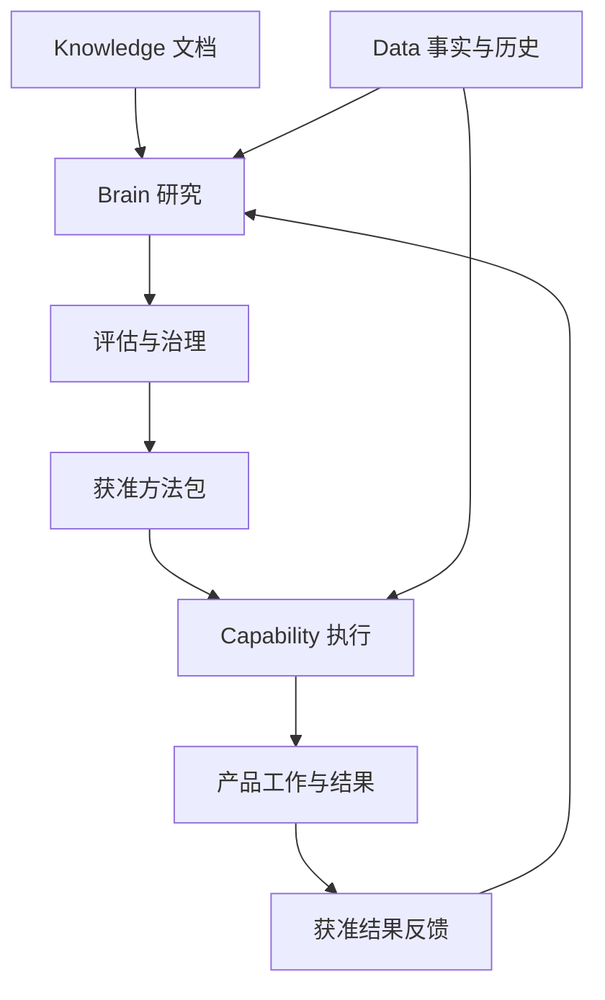

# MO Brain 历史回收、三总监讨论与 1.0—3.0 开发规划

日期：2026-10-09  
状态：**PROPOSED / 待 Product Owner 逐项审阅**。M21 的 **CHANGE REQUESTED** 仍有效。  
研究基线：`yoomarks/markorbit@86715f76d4a5b33839f431e4996a8a00b21c7918`。  
本轮由产品、设计、技术三个独立角色完成考古、提出不同意见、交叉阅读后形成联合建议。没有实施运行时变更，没有替 Owner 批准规格，也没有把源码存在或 PR 合并写成生产成功。

## 1. 本轮结论与检索边界

Brain 的价值应恢复为：**从专业资料和事实中形成可验证的方法，针对具体工作产生有条件的判断、关联、建议与表达计划，再利用真实结果改进方法。** 官费、材料、流程等高频参考是基础；判断路径、上下文、影响分析和实践循环必须进入规划。

采用现有架构：Knowledge 保留文档与来源，Data Engine 保留结构化事实及历史，Brain 研究和编译可复用方法，Capability 执行获准方法，产品保留个案分析和正式业务状态。Brain 作为用户讨论中的“大脑”可以涵盖上述智能价值，但这个称呼不会把全部数据、方法执行、案例结果和业务权限集中到一个新 Owner。

本轮检索并全文复核了 **28 件历史文件**，另复核当前 v0.3、v0.4 用户批注和 2026-10-08 交接包；找到并读完 #276 的 7 条关键架构评论，核对现行架构和实现。GitHub 的 Brain 关键词查询完整取回 **132 个 Issue、89 个 PR 命中**，未截掉后页。命中中含仅在非目标说明里提及 Brain 的外围事项，数量不等于全部 Brain 需求，也不等于已完成能力。

**原始历史聊天检索两次报错，因此不能声称已经恢复全部历次对话。** 此文恢复的是目前可取得的原始文件、仓库讨论、设计与实现证据；未找到原始聊天的批准、否决或日期不自行补写。保存时间、文件内日期、Issue 评论时间分别记录。PDF 使用完整提取文本，未进行图形版式复核。历史文件的“Owner Confirmed Working Baseline”与“本轮产品规格已批准”是两件事。

### 四个阶段建议

| Brain 阶段                      | 核心价值                           | 具体落点                                                                            | 放行依据                                                            |
| ------------------------------- | ---------------------------------- | ----------------------------------------------------------------------------------- | ------------------------------------------------------------------- |
| **1.0：当前工作中的证据化判断** | 不反复解释、少漏资料、知道下一步   | 价格与服务映射、申请资料准备；OA 问题整理；上下文编译、条件路径、创作提纲、工作记录 | 首个任务闭环；缺项/冲突/过期/越权能正确停下；真实专业复核和成本证据 |
| **1.5：跨对象的变化与业务价值** | 一条变化变成可核对的影响清单和机会 | 事件影响、相关行动、基准、具体 OA 方法、ICP、内容机会与实践复盘                     | 小范围真实使用；相关性/漏报/节时/成本；候选与正式业务状态分离       |
| **2.0：机构方法与跨案例验证**   | 可复制团队经验，能适配工作方式     | 私有 SOP、方法组合、主体关系候选、商标/商品双入口机会、案例验证、Provider 适用性    | 私有隔离和撤销；正反案例；方法与组织差异；专业质量非劣和可回退      |
| **3.0：规模化的方法经营**       | 方法持续变好，成本随复用下降       | 方法组合经营、champion/challenger、分层评估、漂移检测、跨范围迁移、有限策略实验     | 可复现真实结果；分层质量与全成本；候选经显式治理后发布              |

这些是 **Brain 能力成熟度**，不等同历史 Cognitive Phase 0—8，也不直接等同 MR/WS 的发行版本。不得因为 Foundation 或 Phase 7 已完成，又从零建设同名平台。

## 2. 找回的历史主线

下表按可证明的保存/仓库时间整理。没有原始讨论日期的材料仅标保存时间，不据此声称讨论发生在当天。

| 时点及原始材料                                                           | 找回的具体设想                                                                                                                                           | 本轮保留与校正                                                                                  |
| ------------------------------------------------------------------------ | -------------------------------------------------------------------------------------------------------------------------------------------------------- | ----------------------------------------------------------------------------------------------- |
| 2026-07-13 保存：Distillery Draft v0.1                                   | 整体理解、结构分析、框架/原则/案例/反例/术语五维提取；产出知识单元、Wiki、Rule、FAQ、Capability、Skill、Workflow Fragment、Marketing Topic、Case Library | 保留“知识成为方法”的目标；五维是覆盖检查。原文“三重验证”没有细则，不能说已冻结                  |
| 同日保存：Round 2.2，14 页                                               | 信息、知识、价值三循环；Brain 是逻辑知识、语义和上下文面；Value Factory 产生风险、机会、任务建议等 11 类候选；Intelligence 做匹配、排序、NBA、解释、反馈 | 恢复三循环及候选隔离；不为每个逻辑职责新建服务，不把建议直接创建成业务对象                      |
| 同日保存：Round 2.1/2.3/2.4、Round 3—6、Canonical Context Map            | Lite 是轻 Workplace/AI 工作入口；Capability/Skill/Agent/Workflow 分工；知识到能力、内容到商机；机构保留私有关系和知识                                    | 保留真实工作闭环和治理，不能把 Lite 改回单纯资讯门户，也不能把 Brain 设成普通用户一级菜单       |
| 2026-07-20 保存：Trademark to Brand Opportunity Engine v0.1              | 市场机会→商品原型→核定商品→商标；或已有商标→品牌场景→内容与反馈                                                                                          | 保留两个入口与商品语义；同类号不是具体商品覆盖，趋势不是成交预测                                |
| 2026-07-21 保存：Data/Knowledge/Brain Architecture、Capability Framework | 数据与文档双加工；结构/知识/关系/来源索引；检索关联推理；Simulation→Shadow→Supervised Production                                                         | 保留双源与实训；Obsidian 只是工作界面/关系信号，不能认定已经有完整知识图谱                      |
| 2026-07-23 保存：Capability OS、Business Capability Map                  | ContextCompiler、SessionReceipt、Reflection→Case/Principle Candidate→验证→能力版本；能力认证/生产授权/专业资格不同                                       | 保留上下文与实践循环；生成收据不等于服务成功，经验候选不自动涨认证等级                          |
| 同日保存：Dual Track Capability Distillation                             | 来源保真的纵向精馏 + 真实问题的横向合成；Source Model/Source Skill/Knowledge Atoms；显式冲突裁决与结果验证                                               | 两轨从 1.0 开始。保留来源完整思想与适用反例，不能只抽碎片；用已有合同承载，不恢复旧平行生命周期 |
| 正文 2026 年 8 月：Lite 每日工作台 V0.9                                  | 业务相关/内容潜力/转化潜力三评分；WhyItMatters、观点角度、生文逻辑、WorthRevisiting、近期业务上下文                                                      | 保留多维价值理由；分数不是校准概率；不强凑固定卡片数量，不默认读取全部邮箱/会议/搜索            |
| 正文 2026-08-18：Global Brand/IP Radar                                   | Story Cluster、跨源去重、历史比较、事件生命周期、官方与实务报告分离、用户相关性、内容价值                                                                | 保留事件与影响分析；转载不算独立证据，多个实务报告不升级为官方规则                              |
| 2026-08-18 保存：Newsletter/Alert Onboarding                             | 来源发现、Endpoint、采集计划、确认记录、覆盖质量                                                                                                         | 作为 Brain 输入需求的历史证据；本轮没有执行旧订阅、发信或抓取命令                               |
| **2026-08-27：#276 评论及 #284 合并**                                    | Knowledge 与 Data 两条 Research 输入；方法研究→评估→编译→Capability 快路径；14 类方法；资产重新归类                                                      | 这是当前已合并架构的重要依据。必须恢复判断方法，同时保持 ownership 分类，不能照搬早期资产名字   |
| 2026-08-31—09-01：Core 交接包                                            | Outcome Evidence、Performance/Coverage Gap、改进 Mission、Method currentness；明确 Brain 不自动 ACTIVE                                                   | 历史技术进度与审批限制保留；后续已修复项不能再当当前缺口                                        |
| 2026-09-16 保存：平台产品评估                                            | 警惕治理系统不断完善，却缺大量真实 Workspace invocation；关注邮件、案件、跟进 SOP 等 dogfood 结果                                                        | 本轮优先真实 consumer 和补接线，不新增宏大框架                                                  |
| 2026-09-14—21 仓库增量                                                   | WIF03/03B/03C、Readiness/Binding、Phase 8 方法族、US citation extraction、Subject Resolution 合同                                                        | 精确区分合同、解释器、持久化、启动接线、质量和产品实际消费                                      |
| 2026-10-08—09：M21 用户批注及本轮                                        | 用户明确指出产出不应只有常量，还应有判断路径和其他类型；要求三总监重新讨论                                                                               | M21 为 CHANGE REQUESTED；此次补回价值范围，形成可审阅规划，不自行改成 APPROVED                  |

### 两个“双轨”必须同时保留

| 维度         | 第一轨                                    | 第二轨                                     | 具体用途                                                     |
| ------------ | ----------------------------------------- | ------------------------------------------ | ------------------------------------------------------------ |
| **研究输入** | Knowledge 文档、条款、案例、SOP、来源关系 | Data Engine 事实、历史、查询、样本、统计   | 规则适用分析需要前者；分布、趋势、主体关系和机会研究需要后者 |
| **方法生产** | 对获准高价值来源做完整、保真的纵向精馏    | 针对实际工作横向选方法、处理冲突、记录结果 | 避免知识碎片化；避免忠于一种理论而忽略实际任务与反证         |

两者不是相互替代的两套架构。一个工作可以用双源，产生实践案例；一个案例再反过来检验来源方法。1.0 就记录候选，2.0 的建设重点是足量证据下的跨案例验证，3.0 负责规模化。阶段是建设重点，不是时间禁令：1.0 得到可信真实结果就记录并可进入既有评估；已有足量获准案例可以提前验证，仍逐方法准入，不为版本号压住经验。

## 3. 原方案逐项取舍

| 旧方案                                    | 裁决                       | 应用环节与条件                                                                                     |
| ----------------------------------------- | -------------------------- | -------------------------------------------------------------------------------------------------- |
| 常量预计算、参考包                        | **保留**                   | 高频费用/材料/程序读路径；绑定源版本、方法、有效范围和失效策略，不能靠模型补数                     |
| 五维精馏、来源完整模型                    | **保留并收窄首批**         | 首批服务的高价值指南/SOP；形成有条件方法和正反例，不要求每条新闻填满五维                           |
| 判断图、推理方法、启发式                  | **1.0 即有窄范围**         | 申请资料/价格/问题整理的条件路径；不能等 2.0 才有实质判断，也不能承诺全球法律意见                  |
| Reflection、Case、Principle               | **从 1.0 积累**            | 工作收据→候选→真实结果→跨案例验证→方法新版；拒绝/失败同样保留                                      |
| 个性化相关性、NBA、事件聚类               | **保留、分批做**           | 1.0 当前对象建议；1.5 跨对象影响与 Today，点击偏好不遮正式期限                                     |
| 多方法 Council/冲突比较                   | **保留业务内核**           | 确有冲突时比较假设、事实、理由和待验证点；不默认多模型开会，复用 1 Primary/0—3 Support/0—1 Critic  |
| ICP→联系人→跟进                           | **采纳用户分工**           | ICP 是可测评 Capability；联系人采购渠道是 Provider；采购、联系及正式线索由原 Owner/Execution 管理  |
| Obsidian/Vault、语义/关系索引             | **按已有能力复用**         | 导航、出处、版本、wikilink/backlink 信号；图数据库只有多跳需求和性能证据成立后才考虑               |
| Local Vault/Metadata/ValueOnly            | **按实际文件需求准入**     | 获准文件可以早用；不等待完整 Crawl Mesh。Metadata/ValueOnly 仍可能暴露客户关系，要按用途和权限投影 |
| SkillTree、XP、Capability Twin            | **后置展示，保留证据底座** | 当前先看真实工作质量和复盘；一次完成不自动认证能力，不把人格孪生作为版本里程碑                     |
| 独立 markorbit-brain 仓库或巨型统一知识库 | **不作为前提**             | 当前 monorepo 已有底座；逻辑统一不要求物理中心化，不能复制源人口或业务人口                         |
| 每次请求重新 Research、自动自训练/发布    | **不采纳这种运行方式**     | 普通任务执行已准入方法；新研究有 Mission/预算/评估，发布仍经显式治理                               |

### 慢研究与快执行的关系

研究消费双源，普通任务消费获准方法和当前输入；共享参考通过已有物化路径供 Capability 读取。反馈是必要证据，不是把产品完整人口搬进 Brain。

## 4. 输出不止常量：类型、存放与消费分开

Foundation 曾定义 12 种认知资产：RESOLVED_VALUE、STATISTICAL_ESTIMATE、RULESET、DECISION_GRAPH、REASONING_METHOD、CASE_PATTERN、CASE_CLUSTER、HEURISTIC、STATISTICAL_PRIOR、SCORING_MODEL、RETRIEVAL_PROFILE、EVALUATION_SET。

现行方法架构列出 14 类：Retrieval、Source Resolution、Temporal Resolution、Classification、Entity Resolution、Relationship Inference、Aggregation、Statistical Analysis、Scoring、Ranking、Risk、Opportunity、Evaluation/Calibration、Method Selection。

**这证明历史价值范围丰富；不证明 12 类资产都有完整编译器，或 14 类方法都已生产运行。** 当前通用 Build 主要编译 RESOLVED_VALUE/STATISTICAL_ESTIMATE，后续方法合同和具体实现分别发展。

#276/#284 已明确重新归类，M21 草稿的“非 canonical 派生资产”不能将所有结果统收 Brain：

| 用户需要的产出                       | 最小内容                                                | 归属/消费                                                                                               |
| ------------------------------------ | ------------------------------------------------------- | ------------------------------------------------------------------------------------------------------- |
| 可引用参考/Reference Candidate       | 来源、条件、生效/截至时间、适用范围                     | 文档/事实归来源 Owner；稳定解析值走既有 Reference materialization；Capability 消费                      |
| 可复用判断方法/Decision Graph        | 条件、分支、证据需求、未知/冲突、停点、正反例、fallback | Brain Method/Executable Package；Capability 执行                                                        |
| 具体案件/工作判断路径                | 当前已知、条件状态、走到的分支、缺项、方案与下一步      | Capability 返回；需要长期保留时由 Work/Matter/产品保存并绑定 method provenance                          |
| Context Package                      | 当次获准对象/事实、少量方法/知识、缺项与输入版本        | 临时受限上下文或原产品快照；不成为 Brain 的全机构记忆库                                                 |
| Derived Benchmark                    | 样本、窗口、分母、算法、偏差、适用范围                  | 研究产物/方法参数，或获准共享 aggregate materialization；不是官方事实                                   |
| Classification/Extraction            | 段落定位、字段或问题候选、未识别/冲突                   | 原业务/证据消费合同；AI 抽取不自动验证事实                                                              |
| Relationship Candidate               | SAME/LIKELY/RENAMED 等依据、时间、冲突及待确认          | 可复用识别方法归 Brain；主体候选/正式主体归相应来源与产品 Owner                                         |
| Risk/Opportunity/Rank/ICP            | 相关理由、反证、适用条件、过期条件                      | 方法归 Brain，Capability 按稳定合同返回执行结果；需保留的个案/候选及跟进人口归产品，采购邮箱是 Provider |
| Change Impact / Next Action          | 旧新差异、影响对象、理由、责任人、确认点                | 产品保留影响/建议；正式改价、创建工作、发送归原 Owner                                                   |
| Content/Expression Plan              | 受众、观点角度、支持/反证、提纲、事实与素材要求         | Content Studio/Creator 消费；不是第二个创作引擎                                                         |
| Reflection/Case/Principle/Evaluation | 改动、实际结果或 pending、条件、失败、许可、方法版本    | 原工作记录归产品；必要的获准反馈进入评估/研究，晋升后才改方法                                           |

Core 的 Official Fee Reference Store 是已有实现落点，Capability 执行/物化机制消费它。此次不搬库、不新建 Brain Reference Registry，也不改变正式费用权威。

“三重验证”本轮建议定义为：**①来源/权威/版本，②逻辑适用/正反例，③任务回放及按风险的专业复核。** 它是待审定义，不是历史已批准细则，不是三个模型投票。低风险表达选择、知识研究、高影响专业意见的验证强度分别确定。

## 5. 1.0 必须可验证的判断路径

统一的是可检查的输出结构，不是用户必须阅读的长篇模型内部思考：

1. **分析对象与问题**：哪个客户/商标/工作、法域、服务、时间与目的。
2. **已知依据**：区分来源事实、用户陈述、业务 Owner 状态、统计和实践信号。
3. **条件状态**：满足、未满足、待补、冲突、不适用；未知值不能按“否”处理。
4. **分支与选项**：可以继续准备、补证、比较路线、停止该判断、交经办复核。
5. **下一步**：补一项、打开原文、核对映射、生成询问/说明稿；正式动作另走既有合同。
6. **重评条件**：源/方法/对象/输入变化后哪些分支需重评，保留旧版与新差异。

### 样例 A：申请资料准备

输入：一个已关联的 Work、目标法域与服务、申请人资料、商标图样、商品表、当前可用方法及参考。

- 对象关联不一致：停止使用错案资料，请核对。
- 主体资料缺失：列具体缺项和所需证明，仍可准备已知材料清单。
- 商品只是市场描述：输出逐项待确认映射，不直接变成核定商品。
- 参考版本过期或不适用：隔离受影响分支，给可继续做的资料整理和核对出口。
- 关键条件齐全：生成材料/问题清单与准备稿，经办确认后由 Work Owner 接纳。
- 不输出“必然可注册”，不自动报件。

### 样例 B：价格与服务范围映射

输入：获准采购报价或外所邮件、当前服务目录、币种/含项/生效时间、开放报价对象。

输出每行“来源项目→拟对应服务→已明确含项→不明确含项→冲突/缺价→需询问”。

外所费用不改叫官费；机构售价、采购成本、税费、统计工期分开。不明确是否含某服务，就生成询问问题。经办确认后由原价格/Quote Owner 创建新版本，不由 Brain 覆写正式价格。

### 样例 C：OA 文件整理

1.0 先提供问题提取、逐项原商品/建议修改/客户指示对照、引证与证据缺口、询问稿。缺原文、对象错误或客户指示冲突时停止该项建议。

实质驳回意见及答复策略在 1.5 按明确法域/问题族准入。既不能将 OA 全部后置，也不能将提取文件写成已具备所有法律策略。

以上是行业任务和验收样例设计，不是对某国现行实体法律规则或真实案件结果的断言。

## 6. Brain 1.0：当前工作闭环

主场景是 **申请资料准备、价格/服务映射**，分别准入；首个 pilot 只选其中一个已批准、来源和 consumer 最齐的 job，不为凑版本同时上线。OA 有限整理、创作提纲是范围明确的辅助功能。它们也只在各自已有获准 consumer 内消费；新增 runner、来源或法域须独立验证/准入，不随首 pilot 自动开放，也不成为首 pilot 放行前提。

| ID / 触发                      | 输入 → 可审阅输出                                                                                               | 接入具体环节                                                 | 验收与成本                                                                                                                                                  |
| ------------------------------ | --------------------------------------------------------------------------------------------------------------- | ------------------------------------------------------------ | ----------------------------------------------------------------------------------------------------------------------------------------------------------- |
| B10-01 开始/继续资料准备       | 当前 Work/Customer/Trademark + 获准方法/参考 → 缺项、条件路径、补问、暂停原因、准备清单                         | M13 Workbench → 现有母 Capability → Work Owner               | 首个 job 的完整/缺项/冲突/过期反例回放；规则优先，非结构化提取才用模型                                                                                      |
| B10-02 导入采购报价/服务表     | 原表/邮件 + 当前服务版本 → 逐行候选映射、含项差异、缺价/询问、PreparedQuote                                     | Quote/Service 校对行、差异预览与确认                         | 不漏行、不猜价、不混官费/采购/售价；修订前后有版本；不重建定价系统                                                                                          |
| B10-03 进入现有工作            | 本次目的、授权对象、相关事实/源/方法 → 最小充分 Context Package                                                 | M13/具体 Capability 的输入组装                               | 相对全量输入质量非劣；token/人工补充分钟；来源与权限变动失效                                                                                                |
| B10-04 获准指南/SOP 更新       | 原来源与范围 → Source Model（问题/命题/论证/假设/边界）、Source Skill/Atoms 研究候选、五维覆盖和关键路径/正反例 | Brain Research + 现有 Knowledge retrieval/lineage + 方法准入 | 首批 1—2 个服务为范围示例；作者原意与 MO 批评分开，旧 Source Skill 名称映射现有 Method 合同；5—10 路径只是试验量示例，未验证仅研究，不是首 pilot 必做满门槛 |
| B10-05 上传 OA/证据文件        | 已关联案件 + 原文/商品/客户指示 → 问题、逐项对照、证据匹配候选、未答问题                                        | Matter/OA Workbench / M13 准备工作                           | 不漏不多、弱匹配不冒充可接受证据；实质意见待专业 review；只对难提取部分调用模型                                                                             |
| B10-06 选择“向客户解释/做内容” | 已审信息 + 受众/用途/CTA → 观点角度、证据提纲、缺口、表达计划                                                   | M16 既有 Creator；私有说明与公域内容用途分开                 | 引用能定位；事实和创意假设分开；不重复造生图/视频引擎                                                                                                       |
| B10-07 用户补充/修改/采用/拒绝 | 工作对话、输入版本、建议和选择 → 持久化工作 receipt、改动、结果 pending、复盘候选                               | Work/Content 原 Owner；学习层只取获准必要证据                | 刷新可恢复；不重复扣费；生成/采用不等于发送/成交/完成                                                                                                       |
| B10-08 重开工作或依赖变化      | 固定历史快照 + 当前源/方法/对象/权限 → 当前可用性、待重评项、新版差异                                           | SourceExplain/Workbench 当前性提示                           | currentness 不能推迟到 1.5；历史回放不再调用新模型，当前重评另走授权与预算                                                                                  |

Today 在 1.0 先投影真实正式待办和当前对象的已解释建议。不是纯官费查询，也不是全平台跨对象智能排序。工作收据、案例候选与隐私保护从这一阶段就开始。

## 7. Brain 1.5：变化、关联和可行动价值

| ID / 触发                        | 输入 → 输出                                                                     | 接入具体环节                                     | 验收与成本                                                                                 |
| -------------------------------- | ------------------------------------------------------------------------------- | ------------------------------------------------ | ------------------------------------------------------------------------------------------ |
| B15-01 来源/价格/要求变化        | 新旧源、有效时间、开放 pin 工作 → 有理由的影响候选清单、不影响项、复核建议      | 价格、案件、客户、Portfolio 批次复核             | 变更/不影响/误关联回放；precision 与漏报分开；只重算受影响开放对象                         |
| B15-02 今日有正式待办/有效候选   | 正式工作事实 + 授权客户/业务背景 + 变化 → 必须处理/适合跟进/可做内容            | Today 与对象页共用建议                           | 真实事件 0..n，不硬凑 7—9 条；期限不受点击降权；可暂缓并保留再次出现条件                   |
| B15-03 查询时长/趋势等对照       | 可复现 DE dataset/query、窗口、coverage → 统计分布/基准/不足说明                | 服务解释、经营与任务规划                         | 带分母/时间/偏差，不当个案承诺；合法共享 aggregate，禁止每用户重扫全量                     |
| B15-04 某 OA 问题族需策略准备    | 已获准 family/method + 个案证据 → 有条件路线、比较、反证与专业核对点            | MarkReg OA Workbench / Capability Recommendation | 每个 job/jurisdiction 单独验证；Phase8 RESEARCH_ONLY 不自动转 ACTIVE；逐案专业 review 单列 |
| B15-05 对一件待售商标找买家      | 可售/商品事实、市场证据、用户目标 → ICP 行业/场景/规模/信号/排除条件、shortlist | M18/M17；ICP Capability → M23 联系人 Provider    | 20 件小样本人工看相关性；不按类号硬推。采购报价/限额/去重/验证单列，采购与发送独立授权     |
| B15-06 同一事件/商标形成内容机会 | Story/知识/实际 logo + 受众/CTA → 相关理由、方向及支持/反证，送既有 Creator     | M16；创作路线的 3×2→选 1 扩展图文/视频           | 模板/资产复用，不等于 6 次新 AI；成品采用、改稿成本、合格咨询分别计                        |
| B15-07 通信/服务阶段有结果       | 原沟通、用户改稿、真实回复/未回复、进展 → 复盘/案例候选、下次未答问题           | M13/Communication/MGSN 协作                      | 草稿/发送/回复/结果分开；失败也记录；私有收费与客户内容不自动共享                          |

方法/实践两轨继续累积，但这些候选不能因“被采用”就成为已验证原则或正式商机。

## 8. Brain 2.0：机构方法与跨案例验证

| ID / 触发                      | 输入 → 输出                                                                     | 接入具体环节                                           | 验收与成本                                                                           |
| ------------------------------ | ------------------------------------------------------------------------------- | ------------------------------------------------------ | ------------------------------------------------------------------------------------ |
| B20-01 团队提交不同 SOP        | 公共 method pin + 私有获准 SOP/范围 → 差异、冲突、overlay、回退                 | 既有 Workspace Profile/binding；工作页提示“本机构做法” | 私有习惯不能覆盖官方要求；10 个真实任务 shadow；发布审核与日常只读分开               |
| B20-02 一工作确需多个方法      | 一个 Primary + 必要 Supporting/Critic → 分节点方案、冲突说明、未决问题          | 既有 Capability composition / Workbench                | 0—3 Support、0—1 Critic；每个辅助都说明价值；无必要不开多模型会                      |
| B20-03 多来源疑似同一主体/关系 | 权威 ID/官方更名链/来源时间/许可 → 主体/关系候选及不确定性                      | Subject360/Customer/Trademark 对照与人工接纳           | 名称/地址不能直接证明 SAME_LEGAL_ENTITY；合同 fixture 不能当生产引擎；不新建全局主档 |
| B20-04 市场机会或自有商标入口  | 商品原型/核定商品/资产 → Exact、ParentChild、Related 区分及品牌使用场景         | M18/M16/M17 两入口机会                                 | 先两行业/约30商品小试；Related 仅探索；不全网抓取后声称覆盖/畅销                     |
| B20-05 重复案件已有可核查结果  | 正反案例、条件、用户修正、结果、许可 → 原则候选、方法 diff、版本评估            | 原产品 outcome → Brain/Evaluation/Method 改进          | 不以一次成功归纳万能规则；时间/案件分组留出防泄漏；私有候选默认私有                  |
| B20-06 选择服务方或运营对照    | 可用合作事实、公开证据、服务/法域/时期 → 分层 benchmark、适用 shortlist、缺样本 | MGSN/报价/分派准备                                     | 文章量/LLM星级不替代履约；没有样本先展示事实不排名；人工 review 与查询费入成本       |

机构记忆可查看、纠正、停用、撤销未来影响。当前客户事实、特殊指示、SOP、个人偏好、共享行业方法分开，个人偏好不能覆盖机构红线，脱敏本身不构成共享许可。从 1.0 开始，一次临时回答不自动记成个人偏好；工作记录的业务留存与候选学习的用途许可分开。既有个人/Workspace 设置可查看、纠正、暂停未来推荐影响，不必等 2.0 或另建 Brain 菜单。

## 9. Brain 3.0：规模化经营方法

| ID / 触发                      | 输入 → 输出                                                                          | 接入具体环节                                   | 验收与成本                                                                             |
| ------------------------------ | ------------------------------------------------------------------------------------ | ---------------------------------------------- | -------------------------------------------------------------------------------------- |
| B30-01 有足量真实任务/覆盖差异 | 固定 baseline、候选方法、适用分层 → portfolio、覆盖/漂移/错误报告、改进 Mission 候选 | 既有 Outcome/Gap/Improvement/Control Center    | Gap≠trigger≠mission≠新方法发布；报告真实分母与缺口，不用全局总分遮局部恶化             |
| B30-02 需要比较新旧版本        | 回放集、批准 shadow/pilot 群、成本上限 → champion/challenger 效果与回退建议          | Method governance + Capability version binding | 先回放/反例、再 shadow/有限试用；评价方独立于生成；predecessor 不改，显式治理才 ACTIVE |
| B30-03 内容/机会打法持续实验   | 主题/方向/资产/渠道版本 + 可核对业务回执 → 有效/失败模式与下一轮小实验               | M16/M17/M18 既有链                             | 不把曝光、点击、生成成功当成交；控制主要变量，退订/退款/失败入分母                     |
| B30-04 方法迁移到新范围        | 已验证 package、许可、正反例、新法域/行业差异 → 迁移评估、适用/不适用范围            | Domain/Capability/Workspace 准入               | 跨法域重新验证；有需求再扩；有限分类/排序模型训练仅在合法样本和独立收益成立时研究      |

训练模型、知识图谱、多 Agent 不是版本定义。规则/检索/现有模型足够时继续使用；只有合法样本、稳定标签、独立评估、可部署性与总成本优势都成立，才准入专用模型。3.0 仍不自动激活、不自动形成专业结论、不自动报件/付款/群发。

## 10. 当前实现：哪些保留，哪些补齐

下列路径均固定到研究 main SHA。源码和测试断言已读；本轮未重跑生产/数据库/模型基准。新规格不应把“代码已合并”“启动构造器已接”“真实任务已达标”混成一个状态。

| 现有部分                      | 证据/当前情况                                                                                                                                | 对规划的影响                                                                                 |
| ----------------------------- | -------------------------------------------------------------------------------------------------------------------------------------------- | -------------------------------------------------------------------------------------------- |
| Asset Registry                | `services/core/src/brain-asset-registry.ts`、`brain-asset-registry-postgres.ts`、0071；main 已构造并物化特定 US markrepresentation lifecycle | 保留版本/准入底座，不建立第二 Registry，也不声称所有方法生产 ACTIVE                          |
| Build / Evidence / Confidence | `brain-build-runtime.ts`、`brain-evidence-resolver.ts`、`brain-confidence-engine.ts`                                                         | Build 主要两类值资产；规则/图/方法需要具体 runner，不靠新增 enum 算完成                      |
| Self Audit / BrainGap         | `brain-build-self-audit-runtime.ts`、`brain-gap-registry-postgres.ts`、0081；内部 constructor 有观察/持久化，读投影已接                      | 不重写；是否需要写路径由具体 consumer 决定，Gap 不自动开研究或升级                           |
| Method / runtime              | `packages/contracts/src/brain-method.ts`、`services/capability-engine/src/executable-method-runtime.ts`                                      | 复用适用选择、schema、runner、证据；不建平行 Agent runtime                                   |
| Performance 改进              | Core main 已接 `method-improvement.ts`、outcome evidence/report Postgres 内部路由                                                            | 有基础不等于自动研究常驻；B2/B3接真实 outcome                                                |
| Coverage Gap 改进             | `method-improvement-coverage-gap-runtime.ts` 及 Postgres，0091；持久化 constructor 存在，当前 main 未常驻构造                                | 旧 inventory“未持久化”过时；按实际覆盖需求补常驻 consumer                                    |
| Cognitive read                | `brain-cognitive-read-postgres.ts`、Gateway/Admin                                                                                            | 管理库存读取已存在；UI可见不等于方法正确或被用户使用                                         |
| Fee/currentness               | Core 既有 Official Fee Reference Store；Capability source/method currentness 已有实现                                                        | 复用真实 activation/source 证据，不制造 identity，不将旧“未接”照抄                           |
| WIF03→03B→03C                 | `workspace-trademark-issue-intelligence.ts`、admission/store、0117；main 有 repository read                                                  | 解释器是注入 interface；未发现真实 provider 解释器/admit 的常驻生产路径，按所选 job 补并实测 |
| WIF04 / WIF08                 | readiness 的 freshness 为 NOT_EVALUATED；binding validity 另校验 currentness；main 注入 Unavailable Knowledge evidence currentness authority | 不能宣称全链 CURRENT；对需要的实际 evidence scope 接 owner authority并证明 source-change行为 |
| Subject resolution            | `packages/contracts/src/brain-subject-resolution.ts`，PR #1402                                                                               | 合同/fixture/fingerprint，不是全量生产关系识别；B2须真实样本和runner                         |
| Phase 8 family                | 已有 family 合同及研究方法；七类 US/CN family仍为 RESEARCH_ONLY                                                                              | US citation extractor已合并不外推全部 family；1.5逐范围验证                                  |
| 产品消费与真实效果            | 历史 Phase 5/6 有 observation/outcome 路径                                                                                                   | 必须拿当前实际 Work/Quote/Content task receipt证明；本轮未取得真实收益样本                   |

应避免把 2026-08 或 09-03 的旧 reachability audit 当今天全部接线状态。开发前重新对所选 job做“输入可达→方法可用→当前性→执行→产品接纳→receipt”的小范围检查。

## 11. 前台如何感到 Brain 的价值

| 入口                         | 显示和操作                                                     | 关键状态                                                       |
| ---------------------------- | -------------------------------------------------------------- | -------------------------------------------------------------- |
| Workbench / M13              | 已知、条件路径、缺项、下一问、准备稿；可修改条件继续           | 资料整理可继续 / 专业判断待复核 / 不适用 / 冲突 / 已变化待重评 |
| Quote/Service                | 逐行映射、含项、缺价、旧新差异；确认后创建新版                 | 未确认映射 / 缺来源 / 待询价 / 可生成准备报价                  |
| Matter/OA                    | 原文段落、问题/商品/证据对照；逐项修正、比较、交经办           | 抽取候选与专业意见分开；不自动删除商品、修改正式期限或报件     |
| Today                        | 先正式急件/待审，再相关变化，再内容机会                        | 未发现变化≠未成功检查；暂缓建议≠解除期限                       |
| Customer/Trademark/Portfolio | 需求候选、影响对象、匹配与不匹配理由；打开具体工作             | 推荐不创建正式客户关系、产权或交易授权                         |
| Create                       | 观点角度、证据提纲、使用限制；送现有 Creator                   | 公域/私域用途明确，私有案卷不默认公开改写                      |
| SourceExplain                | 结论、适用条件、主要依据、反证/未知、下一步；再展开版本与定位  | 当前权限决定能否读原文，不以历史曾可见绕过撤销                 |
| Control Center               | 已有 inventory、依赖、blocked reason、评估、成本；按需求补控制 | 管理操作按当前权限与合同，不要求普通用户了解 Registry/BrainRun |

390px 手机采用纵向卡/分支，来源抽屉保留阅读位置与未提交输入；键盘/读屏可操作，输入法候选不发消息，软键盘不遮主动作。中文默认、英文等价；切 UI 语言不改商标名/客户资料，也不重新调用模型收费。内容语言与界面语言分别设置，引用原文与译文对应。

历史 DecisionPath 固定当时 method/source/object/input。历史回放解释当时结果，不重跑当前模型。源/对象/方法修正后生成 **新分析版本 + 改变的输入/分支差异**；开放工作先提示、按需重算，关闭案例不自动升级。权限撤销后必要审计可保留，阅读端同时遮蔽原文、派生摘要/分支中的敏感事实和历史 Context Package。当前再评估只能用当前获准资料；必要来源已不可见时显示缺证据/不可读取，不能从旧缓存恢复秘密继续判断。历史审计留存不等于产品继续可见。

## 12. 大量用户的成本：共享方法、当前输入、必要推理

共享单位是 **获准公共方法版本、公开参考、合法共享基准**，不是用户完整个案结论。

- 研究慢路径按源版本/数据版本编译；正常工作走已准入方法的快路径。
- 缓存键包含 method/package/source/dataset/input/适用范围与截至时间。私有输入额外绑定 Workspace、当前授权、Owner 对象版本。
- 来源变化根据依赖索引处理受影响方法/参考与开放 pin 工作，不全用户全量重跑。
- 确定性 diff/映射/计算优先；模型负责确有必要的提取、候选分析、语言表达。Critic按风险和问题需要调用。
- 暂时无可用方法/来源时保留资料整理、缺项及转人工出口，不用模型记忆补事实。
- 每个 task 有尝试/总预算、可恢复状态和幂等收据；重开任务先读原作业，不能重复扣费。新研究与普通读取分开预览成本。
- 日常基础消费、重计算/私有精馏、人工专业服务分别计量，复用现有 entitlement/Billing/Provider 路径。普通 WS1不因支持Provider就开放BYOK；WS2/MarkReg受控凭据按当前规则。
- 新技术许可、数据/联系人采购、储存与查询、模型、失败、评估与人工都要计入，不只比较 token。

### 三种人工成本分开

`C_total = C_platform + C_research_and_method_review + C_runtime_attempts + C_quality_sampling + C_case_professional_review + C_data/provider/retention`

1. 方法准入/版本评估是共享固定或批次成本。
2. 低风险运营质量抽查是抽样成本。
3. 要求专业复核的具体案件按实际逐案复核和返工计价，不能用 1% 抽查代替。

### 可复算的规模假设，非真实报价

以下金额单位为人民币。**10k/100k指月活用户，非注册用户；每人每月20次辅助任务。** 85%走确定性/共享快路径，每次0.004；15%需要模型，每 attempt 0.12。假设每次模型尝试成功率90%，独立、最多2次：平均尝试1.1次，模型作业成功99%。实际模型尝试可能不独立，真实数据取得后替换；模型作业成功也不等于专业任务成功。

低风险QA按全部辅助请求的1%×2分钟×1元/分钟，作为预算抽样假设；共享研究/评估500批×8=4,000；固定运行分别3,000/12,000。下面没有覆盖必须逐案专业复核、税/许可、实际供应商采购、完整员工成本或全部数据基础设施，不能作为对用户售价或MO整个平台预算。

| 项目                     | 10k月活 / 200k任务 | 100k月活 / 2m任务 |
| ------------------------ | -----------------: | ----------------: |
| 快路径                   |                680 |             6,800 |
| 模型尝试                 |              3,960 |            39,600 |
| 低风险QA抽样             |              4,000 |            40,000 |
| 共享研究/评估预算        |              4,000 |             4,000 |
| 固定运行                 |              3,000 |            12,000 |
| **示例计算服务预算小计** |         **15,640** |       **102,400** |
| 每月活用户               |              1.564 |             1.024 |
| 每个请求                 |             0.0782 |            0.0512 |

没有真实任务成功分母，因此此表不是“每成功任务成本”，不是节省已被验证。

| 敏感性情景                              |         10k小计 |          100k小计 | 意义                                                            |
| --------------------------------------- | --------------: | ----------------: | --------------------------------------------------------------- |
| 模型比例15%→40%，其他假设相同           |          22,040 |           166,400 | 限制无必要的模型链有价值，但质量必须保持                        |
| 模型每attempt 0.12→0.60，原比例         |          31,480 |           260,800 | 不能承诺无限强模型包含在低价会员里                              |
| 若10%任务需专业复核，每案8分钟×3元/分钟 | **另加480,000** | **另加4,800,000** | 完全是假设，用于说明逐案人工能成为主要成本，不能被便宜token掩盖 |

高风险专业复核可以由已有机构经办完成，也可以是另外定价的专业服务。谁承担、哪些分钟是原流程已有成本、哪些是新增成本，必须分列；不能假设 AI必定节省某个比例的人工。

100k用户仍只500研究批是假设公开方法共享。大量私有overlay或高频私有精馏须另加编译/专家评估，不把用户案件复制到公共缓存求便宜。对低风险一般会员，预算重点是可复用快路径和有限难题；必审专业服务有明确任务和收费归属。

## 13. 如何验证“可成功”，而非只证明模型能输出

所有门槛是待审试验设计，不是本轮已经取得的结果。小样本能发现问题，不保证广泛可靠或市场成功。

| 阶段 | 技术/专业门槛                                                                                                   | 产品/业务试验                                                                                 | 成本/放行                                                                                                                           |
| ---- | --------------------------------------------------------------------------------------------------------------- | --------------------------------------------------------------------------------------------- | ----------------------------------------------------------------------------------------------------------------------------------- |
| 1.0  | 首job至少20个回放 + 缺项/冲突/过期/不适用/越权/源变化反例；适格人员标注预期分支；来源定位完整；已知严重错误阻断 | 约10—20个真实授权工作，跟现流程比较遗漏、补问、专业修正分钟与可采用结果；不是只测provider成功 | 记录全部任务、失败/中断、人审；达到预设回放标准、该试验范围内未发现已知劣化且任务预算成立，才开放下一批；不以小样本声称统计非劣证明 |
| 1.5  | 每个新增法域/job分别验证；影响对象的precision/recall和统计coverage；ICP商品匹配误差                             | 约30条影响候选、20件待售标小样本；区分被采纳、成功送达、回复、合格咨询、委托                  | 获取邮箱/数据/发布/渲染/人审计入；不能拿推荐分数替代业务回执                                                                        |
| 2.0  | overlay冲突、撤销、同条件一致、相似案例关键差异；留出不同案件/时期防评估泄漏                                    | 按机构和服务分组shadow；比较老员工/新员工的补问与返工；验证私有方法确有改善                   | 质量分层非劣，专业审核和私有编译可承担；可回退才发布                                                                                |
| 3.0  | 固定baseline→候选→回放→shadow/pilot→显式governance；反例/漂移/退化可见                                          | 足量真实任务/投放分母；预先确定主要指标、样本与观察周期，减少同时变商品/价格/渠道/模型        | 看质量、时间和全成本/成功任务；局部恶化不能被平均分掩盖                                                                             |

首job评估必须包含：未知不当否；低置信不代替适用性；冲突不平均成空话；缺证据时能继续合理准备但停止受影响判断；来源当前性不可证明时不写“最新”；业务和源权限撤销后不泄露。

主要指标与分母：

- 错误/遗漏：正确提取项与所有应提取项；错误路径/全部评审任务；严重错误单列。
- 影响：真正相关/全部提示，漏报/全部实际受影响对象。
- 效率：完整工作的人工分钟、往返次数、完成时延；不要只报模型响应速度。
- 内容：可采用成品/全部试验任务，人工改稿分钟，全成本/采用成品。
- 增长：合格咨询/可核对送达或渠道访问，委托/合格咨询，成交/委托；时间窗、重复联系人、机器人/重复访问和退款分开。
- 学习：工作receipt、复盘候选、核对真实结果、通过验证的新方法分别计数。
- 费用：总试验成本与全体任务分母；中断、失败、转人工不得删掉抬成功率。

ICP Provider链尤其要区分“画像相关→买到邮箱→邮箱验证→成功送达→真实回复→合格咨询→委托/成交”。购买邮箱不是客户获取成功，也不自带发送权限。

## 14. 可执行开发顺序与任务包

不给没有团队容量、已批准范围和基准的功能硬填日历。按下列可验收包排序，首job通过后才扩大。架构接口可以超前，但实际实现由已批准consumer需求驱动。

| Task / 优先级          | 具体交付                                                                   | 既有区域与合同                                                   | 状态/事件/验收                                                                           |
| ---------------------- | -------------------------------------------------------------------------- | ---------------------------------------------------------------- | ---------------------------------------------------------------------------------------- |
| BRN-R0 / 第一包        | M21输出与ownership映射；首job、实际输入/runner/消费/当前性缺口清单         | docs + Brain/Capability/Knowledge/DE/Product当前合同             | 不动canon或另立registry；标现存/缺口/验证事实                                            |
| BRN-R1 / 首job基础     | 真实源/引用定位、适用method/currentness、有限解释器/提取路径；逐字段可回放 | 所选服务Owner + Core/Capability，依赖现Knowledge export/DE query | missing/conflicting/stale/unavailable与success明确；真实restart/admission按涉及owner验证 |
| BRN-R2 / 1.0工作消费   | 条件路径→补问/校对→Prepared结果→Work/Quote receipt                         | M13/Quote/Work consumer，shared types复用                        | 刷新恢复、expected version/幂等/权限；源改变新result+diff；UI按仓库ui-design流程         |
| BRN-R3 / 1.0方法生产   | 一个获准指南/SOP完整小范围包、正反例、baseline与评估                       | Brain Research/Method、现有Registry/Evaluation                   | candidate→evaluation→compile，ACTIVE另由治理；不把三验证写成三模型                       |
| BRN-R4 / 1.5影响与候选 | 一事件/一个服务/开放工作impact；ICP的稳定结果合同与Provider接口分离        | Value/Intelligence逻辑映射到既有Owner；M17/M18/M23               | 候选接纳/排除/过期在产品；不直接发送、改价或创建正式商机                                 |
| BRN-R5 / 2.0私有方法   | SOP差异、scope/binding/revoke、案例反馈与验证                              | 已有WIF/Profile/Knowledge/Capability/Outcome                     | 私有隔离、失效、历史回放、复核成本与shadow证据                                           |
| BRN-R6 / 3.0方法经营   | portfolio评估、触发/Mission、champion/challenger、显式发布与回退           | 已有Improvement/Outcome/Brain Governance/Control Center          | 不自动ACTIVE；真实分层效果/成本；不再造改进平台                                          |

每个实现 Issue 再按 AGENTS 写清 Task ID、允许路径、目标与消费者、canon、合同、行为、状态、UI、事件、验收、命令、非目标、PR标题。实际code范围和migration仅在任务确定后冻结，不以此研究报告直接授权全部实现。

首job建议优先 **申请资料准备**：最能验证判断路径、缺项补问、对象上下文与工作receipt；价格/服务映射作为第二条独立准入旅程。若现有输入/consumer证据表明价格映射更齐，交换顺序即可，功能范围与质量门槛不变。两条不打包成“都做好才能用”的大项目。

## 15. 三总监真实分歧与联合裁决

| 争议                      | 产品总监                                             | 设计总监                                | 技术总监                                 | 联合裁决                                                         |
| ------------------------- | ---------------------------------------------------- | --------------------------------------- | ---------------------------------------- | ---------------------------------------------------------------- |
| 1.0是否只查reference      | 必须有工作判断与实践记录                             | 六段条件路径和不知道/下一步必须前台可用 | 限定method/scope与真实证据，不能只加散文 | 1.0窄而完整，规则+条件路径，不退回常量中心                       |
| 首发是OA还是filing/quote  | filing/quote主consumer；OA保留整理，实质策略逐族准入 | 首pilot选一个旅程，不被多场景验收阻断   | 依据现有源/runner/消费接线选择           | 两主旅程分别准入；首pilot建议filing，OA有限整理不整体后置        |
| Today是否先做全量智能     | 当前对象先；跨对象1.5                                | 急件/正式事实先，不固定7—9条            | 避免全Workspace推理与重复候选池          | 1.0正式待办+当前建议；1.5关联事件，候选归产品                    |
| 学习何时开始              | 双轨1.0开始，不等3.0                                 | 保存修正/失败，用户无需长复盘表         | 记录与方法晋升不同，不能自动activation   | 1.0收据/候选；1.5真实结果；2.0跨案例验证；3.0规模化              |
| 五维/三验证是否每次重做   | 重要来源完整，任务按节点取需要的部分                 | 五维是覆盖检查，不能强迫用户填表        | 复用retrieval/lineage，分风险评估        | 精馏在慢路径，生产消费编译资产；三验证细则待审                   |
| 多方法是否默认多Agent开会 | 只在真正冲突时合成                                   | 前台比较可核对选项，不展示内部术语      | 复用既有composition/预算                 | 1 Primary/0—3 Support/0—1 Critic按需，通常不默认三模型           |
| 1%审核是否代表专业费用    | 必审案件必须逐案核算                                 | 区分可整理/专业意见待审                 | 分抽样QA、专业review、方法准入           | 成本三栏，不能用低价模型算例卖无限法律判断                       |
| M21派生资产是否统归Brain  | 语义产出与长期owner分开                              | 来源和归属在SourceExplain清楚           | #284分类优先，Core Reference实现不迁库   | Brain方法/研究，Capability执行/获准物化，产品个案与业务人口      |
| 变化是否覆盖旧结果        | 显示新条件及受影响工作                               | 新分析版本+差异；撤销后不可继续读私源   | 方法/输入pin与dependency失效             | 历史回放保持当时，当前重评另走授权；开放工作按需，不自动升级闭案 |
| 收费与阶段                | 基础复用应低成本，难任务/专业服务明确                | 不为日常只读多造审批                    | 共享public method，private严格隔离       | 复用已有计量/权限；重研究/私有精馏/人工服务单列                  |

这是三角色的联合建议，不伪装成真实组织会议出席，也不将技术否决外部自动执行理解成否决所有智能判断。

## 16. 三条发布轨道

| Brain成熟度 | MarkReg先验证                               | 普通Workspace开放                  | 保持                                           |
| ----------- | ------------------------------------------- | ---------------------------------- | ---------------------------------------------- |
| 1.0         | 普通Workspace内MarkReg Profile dogfood首job | WS1仅消费已验证/获准的任务与版本   | 同合同、不fork；当前基础能力不人为撤下         |
| 1.5         | MR Forward试变化/ICP/具体策略/内容候选      | 普通WS稳定消费前一波；功能分项准入 | 不因阶段号整包开放、不把provider凭据当会员资格 |
| 2.0         | 私有SOP、案例验证、有限方法组合             | WS2按机构/服务/范围开放            | 私有关系与记忆仍由Workplace控制                |
| 3.0         | 真实方法/渠道策略实验与迁移评估             | WS3消费证明有效的版本              | 仍显式治理、currentness、撤销与回退            |

“MarkReg先一波”指验证顺序，不是产品版本号码的机械对应。Brain Architecture Runway可以超前；用户仍从工作、客户、商标、内容看到价值。

## 17. 本轮沟通与决策记录

### 用户明确要求，继续约束本轮

- 找回此前 Brain 的讨论、设想、设计，再三总监头脑风暴 1.0/1.5/2.0/3.0。
- M21输出不能只有常量，应恢复判断路径和其他价值。
- 借鉴必须对应具体功能/环节，不能泛泛谈理念；沟通要入库。
- ICP作为Capability，采购联系人邮箱渠道作为Provider。
- 真实商标行业需要可验证的专业与商业结果；大量用户成本要考虑；旧方案不能一概否定或肯定。

### 本轮联合建议（全部PROPOSED，未当作Owner批准）

| 决策ID            | 建议                                                           | 状态                         |
| ----------------- | -------------------------------------------------------------- | ---------------------------- |
| BRAIN-20261009-01 | 恢复方法、条件路径、上下文、影响、价值候选、表达计划与实践循环 | PROPOSED                     |
| BRAIN-20261009-02 | 以#284当前ownership分类承载，M21不得统收所有派生/个案结果      | PROPOSED；现有canon继续适用  |
| BRAIN-20261009-03 | 1.0两主旅程分别准入；首pilot建议申请资料准备，OA有限整理       | PROPOSED                     |
| BRAIN-20261009-04 | Knowledge/Data输入双源，与来源精馏/实践合成两生产轨并存        | PROPOSED                     |
| BRAIN-20261009-05 | 1.0记录候选，2.0验证方法，3.0规模化，不自动晋升                | PROPOSED                     |
| BRAIN-20261009-06 | ICP Capability / 联系人Provider / 正式线索与动作Owner分工      | 用户明确意图；具体实现待规格 |
| BRAIN-20261009-07 | 多方法按真实节点与预算使用，复用既有composition                | PROPOSED；canon基数继续适用  |
| BRAIN-20261009-08 | 方法准入、抽样QA、逐案专业review成本分开                       | PROPOSED                     |
| BRAIN-20261009-09 | 历史版本pin，当前重评另建result+diff，撤销限制阅读             | PROPOSED                     |
| BRAIN-20261009-10 | 以实际consumer/当前接线/真实结果验收，停止新建平行框架         | PROPOSED                     |
| BRAIN-20261009-11 | 共享公共method，不共享私有个案结论；实际研究与专业服务有预算   | PROPOSED                     |
| BRAIN-20261009-12 | 四成熟度与MR/WS发布分开记账，MarkReg先验证                     | PROPOSED                     |

尚需Owner审阅的实质取舍：首job及法域/服务范围、1.5首批实质判断family、谁承担逐案专业复核、私有SOP/反馈的共享许可。现有证据足够先提供完整规格与评估样例；没有自动授予开发全部功能或改canonical ownership的权限。

## 18. 来源索引与缺口

下附原始文件索引、关键仓库讨论、源码定位和三总监交叉证据。保存UTC仅描述文件元数据；未提供Library历史version_id的文件不能声称锁定了历史发布版本。本轮保留了当前读到的完整文本；同名同内容重复上传不当成两次新的决定。

原始聊天故障仍是缺口。若后续恢复新聊天或旧方案，它应新增到此记录并标明“改变哪项决定/哪版本”，而不是再次靠口头印象覆盖。没有证据的“以前已一致同意”不写成事实。

此报告承接已完成的创作研究，Brain提供方法/上下文/表达与评估，Creator负责图文视频产物；不把Brain重新规划当作推翻创作路线的理由。

## 附录 A：28 件历史原文索引

下表的日期均为保存元数据UTC；正文日期/效力另列。PDF档案为完整提取文本，不是原PDF二进制。长文均续读到末段；仅排版/换行提取差异，不声称档案与原文件字节一致。原文档案中的 sources/ 路径按此表编号对应。

| 编号 | 原文件名                                                                        | 保存UTC                     | 内容/效力                                              | 原文档案路径                                                                                 |
| ---- | ------------------------------------------------------------------------------- | --------------------------- | ------------------------------------------------------ | -------------------------------------------------------------------------------------------- |
| R01  | Mo_Distillery（知识精馏工厂）构想总结.md                                        | 2026-07-13T02:38:09.582233Z | Draft v0.1 / 精馏方法与五维                            | `sources/01-Mo_Distillery（知识精馏工厂）构想总结.md`                                        |
| R02  | Round 2.2 Decision Record.pdf                                                   | 2026-07-13T06:25:54.029027Z | 14页全文文本 / 三循环与候选                            | `sources/02-Round-2.2-Decision-Record.pdf-extracted.txt`                                     |
| R03  | MarkOrbit_Capability_OS_Strategy_Summary.md                                     | 2026-07-23T13:55:46.879542Z | 战略设想 / ContextCompiler、SessionReceipt、Reflection | `sources/03-MarkOrbit_Capability_OS_Strategy_Summary.md`                                     |
| R04  | mo_lite_value_recommendation_summary(1).md                                      | 2026-07-13T01:22:18.463637Z | Draft v0.1 / Value、NBA、LocalVault                    | `sources/04-mo_lite_value_recommendation_summary(1).md`                                      |
| R05  | MarkOrbit_Lite_Trademark_to_Brand_Opportunity_Engine_PRD.md                     | 2026-07-20T12:14:37.926611Z | v0.1 / 商品与商标双入口                                | `sources/05-MarkOrbit_Lite_Trademark_to_Brand_Opportunity_Engine_PRD.md`                     |
| R06  | MO_Dual_Track_Capability_Distillation_Strategy.md                               | 2026-07-23T19:09:08.546992Z | 战略设想 / 来源完整模型与实践合成                      | `sources/06-MO_Dual_Track_Capability_Distillation_Strategy.md`                               |
| R07  | 04_CAPABILITY_FRAMEWORK.md                                                      | 2026-07-21T13:43:49.935345Z | 建议框架 / 资格、实训、shadow                          | `sources/07-04_CAPABILITY_FRAMEWORK.md`                                                      |
| R08  | MO_Business_Capability_Map_v1.0.md                                              | 2026-07-23T14:23:51.328887Z | 战略设想 / 十域及结果成长                              | `sources/08-MO_Business_Capability_Map_v1.0.md`                                              |
| R09  | MO Lite 每日工作台产品规划书.md                                                 | 2026-08-17T22:02:53.607065Z | V0.9 / 正文2026年8月 / WhyItMatters及三评分            | `sources/09-daily-workspace-202608.md`                                                       |
| R10  | MarkOrbit_Global_Brand_IP_Radar_Planning_v1_2026-08-18.md                       | 2026-08-17T17:17:27.276634Z | v1.0 / 正文2026-08-18 / StoryCluster与diff             | `sources/10-global-brand-ip-radar-20260818.md`                                               |
| R11  | MarkOrbit Radar Newsletter & Alert Onboarding — Codex 完整项目指令.md           | 2026-08-18T00:06:52.042353Z | 历史执行指令 / 不执行其旧任务                          | `sources/11-radar-newsletter-onboarding-20260818.md`                                         |
| R12  | MarkOrbit Canonical Context Map v0.1.pdf                                        | 2026-07-13T06:25:58.108332Z | 11页全文文本 / 自称working baseline，非本轮审批        | `sources/12-canonical-context-map-v01-pdf-text.md`                                           |
| R13  | 06_DATA_KNOWLEDGE_BRAIN_ARCHITECTURE.md                                         | 2026-07-21T13:43:51.691068Z | 架构设想 / 双加工、索引、关联                          | `sources/13-06_DATA_KNOWLEDGE_BRAIN_ARCHITECTURE.md`                                         |
| R14  | B04-CH-14_Knowledge_Consumption_and_the_Brain_Boundary.md                       | 2026-07-13T16:28:37.009425Z | Draft1 / 共享与私有知识消费边界                        | `sources/14-B04-CH-14_Knowledge_Consumption_and_the_Brain_Boundary.md`                       |
| R15  | B04-CH-10_Private_Knowledge_AI_Context_Preferences_and_Organizational_Memory.md | 2026-07-13T15:36:44.122005Z | Draft1 / 权限、上下文与组织记忆                        | `sources/15-B04-CH-10_Private_Knowledge_AI_Context_Preferences_and_Organizational_Memory.md` |
| R16  | MarkOrbit_Knowledge_PRD_v1.0_Draft.md                                           | 2026-07-15T15:05:32.766763Z | Draft / 入口、Raw、ReadyPackage、Core消费              | `sources/16-MarkOrbit_Knowledge_PRD_v1.0_Draft.md`                                           |
| R17  | KNOWLEDGE_DOMAIN_ROADMAP.md                                                     | 2026-08-06T21:33:03.056852Z | Proposed / real closed loop与receipt                   | `sources/17-KNOWLEDGE_DOMAIN_ROADMAP.md`                                                     |
| R18  | MarkOrbit_Core_New_Chat_Handoff_FULL_2026-08-31_1128.md                         | 2026-08-31T04:02:44.350453Z | 正文快照2026-08-31 / Phase6—7                          | `sources/18-MarkOrbit_Core_New_Chat_Handoff_FULL_2026-08-31_1128.md`                         |
| R19  | MarkOrbit_Core_Cognitive_Platform_New_Chat_Handoff_2026-09-01_1720.md           | 2026-09-01T09:24:26.113493Z | 日期绑定交接 / activation与currentness                 | `sources/19-MarkOrbit_Core_Cognitive_Platform_New_Chat_Handoff_2026-09-01_1720.md`           |
| R20  | MarkOrbit_Core_Cognitive_Platform_New_Chat_Handoff_2026-09-01.md                | 2026-08-31T18:41:30.481180Z | 日期绑定交接 / maturity、gap与runtime                  | `sources/20-MarkOrbit_Core_Cognitive_Platform_New_Chat_Handoff_2026-09-01.md`                |
| R21  | 粘贴的 markdown (1)。md(4)                                                      | 2026-09-16T04:09:23.220909Z | 粘贴评估 / 真实调用优先，正文未标确切制定日            | `sources/21-platform-product-assessment-20260916.md`                                         |
| R22  | Round 2.1 Decision Record.pdf                                                   | 2026-07-13T06:25:54.116981Z | 7页全文文本 / Workplace、Lite、MarkReg、MGSN           | `sources/22-Round-2.1-Decision-Record-pdf-text.md`                                           |
| R23  | Round 2.3 Decision Record.pdf                                                   | 2026-07-13T06:25:53.858400Z | 18页全文文本 / Capability、Skill、Agent、Distillery    | `sources/23-Round-2.3-Decision-Record-pdf-text.md`                                           |
| R24  | Round 2.4 Decision Record.pdf                                                   | 2026-07-13T06:25:54.099353Z | 3页全文文本 / Artifact与机会候选                       | `sources/24-Round-2.4-Decision-Record-pdf-text.md`                                           |
| R25  | Round 3 Decision Record.pdf                                                     | 2026-07-13T06:25:53.331197Z | 4页全文文本 / 横向运行平面                             | `sources/25-Round-3-Decision-Record-pdf-text.md`                                             |
| R26  | Round 4 Decision Record.pdf                                                     | 2026-07-13T06:25:53.413704Z | 5页全文文本 / 产品与共享能力                           | `sources/26-Round-4-Decision-Record-pdf-text.md`                                             |
| R27  | Round 5 Decision Record.pdf                                                     | 2026-07-13T06:25:54.230385Z | 6页全文文本 / 五价值与真实闭环                         | `sources/27-Round-5-Decision-Record-pdf-text.md`                                             |
| R28  | Round 6 Final Decision Record.pdf                                               | 2026-07-13T06:25:55.556905Z | 10页全文文本 / Orbit、私有关系、治理                   | `sources/28-Round-6-Final-Decision-Record-pdf-text.md`                                       |

另有本轮直接读取的已选文件：MarkOrbit_Product_Master_Spec_v0.3.md（DRAFT）、MarkOrbit_Product_Master_Spec_v0.4_Three_Director_Review_CN.docx（M21明确CHANGE REQUESTED）、MO_New_Chat_Handoff_2026-10-08.md（日期绑定交接）。它们不计入28件旧文件的数字。

## 附录 B：关键仓库讨论与固定源码

- 现行Research/Compile/Capability所有权：[docs/architecture/COGNITIVE_PLATFORM_ARCHITECTURE.md](https://github.com/yoomarks/markorbit/blob/86715f76d4a5b33839f431e4996a8a00b21c7918/docs/architecture/COGNITIVE_PLATFORM_ARCHITECTURE.md)。
- Foundation12种历史资产：[docs/architecture/BRAIN-FOUNDATION-ARCHITECTURE.md](https://github.com/yoomarks/markorbit/blob/86715f76d4a5b33839f431e4996a8a00b21c7918/docs/architecture/BRAIN-FOUNDATION-ARCHITECTURE.md)。
- Phase0重新归类；历史阻塞需看后续评论：[docs/audits/COGNITIVE-PLATFORM-PHASE0-AUDIT-2026-08-27.md](https://github.com/yoomarks/markorbit/blob/86715f76d4a5b33839f431e4996a8a00b21c7918/docs/audits/COGNITIVE-PLATFORM-PHASE0-AUDIT-2026-08-27.md)。
- 历史Phase0—8路线，不等于新产品版本：[docs/roadmap/COGNITIVE_PLATFORM_LONG_TERM_ROADMAP.md](https://github.com/yoomarks/markorbit/blob/86715f76d4a5b33839f431e4996a8a00b21c7918/docs/roadmap/COGNITIVE_PLATFORM_LONG_TERM_ROADMAP.md)。
- Method14类及适用/评估合同：[packages/contracts/src/brain-method.ts](https://github.com/yoomarks/markorbit/blob/86715f76d4a5b33839f431e4996a8a00b21c7918/packages/contracts/src/brain-method.ts)。
- Phase8七族RESEARCH_ONLY：[docs/architecture/TRADEMARK-INTELLIGENCE-METHOD-FAMILIES-V1.md](https://github.com/yoomarks/markorbit/blob/86715f76d4a5b33839f431e4996a8a00b21c7918/docs/architecture/TRADEMARK-INTELLIGENCE-METHOD-FAMILIES-V1.md)。
- SubjectResolution合同与fixture边界：[packages/contracts/src/brain-subject-resolution.ts](https://github.com/yoomarks/markorbit/blob/86715f76d4a5b33839f431e4996a8a00b21c7918/packages/contracts/src/brain-subject-resolution.ts)。
- 启动接线基线：[services/core/src/main.ts](https://github.com/yoomarks/markorbit/blob/86715f76d4a5b33839f431e4996a8a00b21c7918/services/core/src/main.ts)。
- Capability运行基线：[services/capability-engine/src/main.ts](https://github.com/yoomarks/markorbit/blob/86715f76d4a5b33839f431e4996a8a00b21c7918/services/capability-engine/src/main.ts)。
- 执行获准方法：[services/capability-engine/src/executable-method-runtime.ts](https://github.com/yoomarks/markorbit/blob/86715f76d4a5b33839f431e4996a8a00b21c7918/services/capability-engine/src/executable-method-runtime.ts)。

[#276完整架构讨论](https://github.com/yoomarks/markorbit/issues/276)的7条评论（2026-08-27）补回双源Research、资产重分类、跨仓准入与后续source lineage修正；已读正文，不仅根据标题。[#284合并](https://github.com/yoomarks/markorbit/pull/284)为4a094c8ba81c557c5528b9dc9b04eaab3d8032f6。仍写Proposed的历史文件标题不能抹去该次仓库接受记录，也不能让未批准的M21覆写它。

实施链索引：Foundation #256—#275；架构审计 #276/#282；方法合同 #285/#286；reference #287/#290/#292/#293；DE研究 #297/#298/#301；Runtime #307/#308/#313；产品消费 #322/#324/#325；Outcome #328/#341/#342/#343/#344/#345/#346；MethodImprovement #347/#348/#349/#350/#384/#389；durableGap #531/#533/#664；WIF #1216/#1233/#1243/#1246/#1249/#1272；industryFamily #1330/#1331/#1357；subject #1397/#1402。BRN序号存在重用，以实际Issue/PR/path/commit判断，不仅看标签。

明确核对的merge：#1216=8fe6bff83676b90ba1ea5771988f8e354608091e；#1331=ccb481c3e96c356c58ec123ddadbeb14940b2703；#1357=287bf1c42ef94b894e95424411edcceabfa379e9；#1402=2474fc16548e5dd0cb3bb5a7c679315b0947f0df。合并只证明仓库变化，不证明生产调用或业务收益。

## 附录 C：三总监证据与创作交叉引用

原文档案的 directors/ 下包含产品、设计、技术三份独立评审；各自标明实际读过的来源、未做的验证、原始分歧与交叉裁决。正文§15是统一裁决，仍为待审。

创作规划：[Draft PR #1494](https://github.com/yoomarks/markorbit/pull/1494)，head 02b8a064b0110440a24f4cba9fa019d0949f254d。Brain的Creator Intelligence输出方法/上下文/表达计划与评估，现有Creator负责实际图文视频，不能重建一套生成器。
